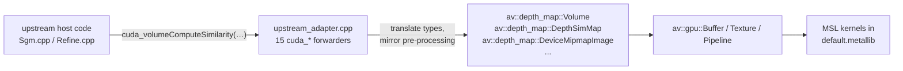

# Adapter pattern

The 15 `cuda_*` forwarder functions in
`src/depth_map_metal/src/upstream_adapter.cpp` are the bridge between
upstream's host orchestration code (`Sgm.cpp`, `Refine.cpp`,
`DepthMapEstimator.cpp`, `NormalMapEstimator.cpp`) and our Metal kernel
layer.

This page documents the rules every forwarder follows. **Read this before
touching any `cuda_*` symbol.**

## Surface



The 15 forwarders (sorted by upstream module):

| # | Symbol | Backing class |
|---|---|---|
| 1 | `cuda_volumeInitialize<TSim>`              | `Volume::init_sim` |
| 2 | `cuda_volumeInitialize<TSimRefine>`        | `Volume::init_refine` |
| 3 | `cuda_volumeAdd`                           | `Volume::add_refine` |
| 4 | `cuda_volumeUpdateUninitializedSimilarity` | `Volume::update_uninitialized` |
| 5 | `cuda_volumeComputeSimilarity`             | `Volume::compute_similarity` |
| 6 | `cuda_volumeRefineSimilarity`              | `Volume::refine_similarity` |
| 7 | `cuda_volumeOptimize`                      | `Volume::optimize` |
| 8 | `cuda_volumeRetrieveBestDepth`             | `Volume::retrieve_best_depth` |
| 9 | `cuda_volumeRefineBestDepth`               | `Volume::refine_best_depth` |
| 10 | `cuda_depthSimMapCopyDepthOnly`           | `DepthSimMap::copy_depth_only` |
| 11 | `cuda_normalMapUpscale`                   | `DepthSimMap::normal_map_upscale` |
| 12 | `cuda_depthThicknessSmoothThickness`      | `DepthSimMap::smooth_thickness` |
| 13 | `cuda_computeSgmUpscaledDepthPixSizeMap`  | `DepthSimMap::compute_sgm_upscaled_…` |
| 14 | `cuda_depthSimMapComputeNormal`           | `DepthSimMap::compute_normal` |
| 15 | `cuda_depthSimMapOptimizeGradientDescent` | `DepthSimMap::optimize_depth_sim_map` |

All 15 are confirmed wrapped in `AV_ADAPTER_PROFILE_SCOPE("…")` for the
opt-in profiler (line numbers grep at `AV_ADAPTER_PROFILE_SCOPE` in
`upstream_adapter.cpp` lines 153, 169, 185, 202, 228, 290, 361, 421, 486,
526, 543, 562, 594, 633, 666).

## Rule #1 — every parameter must mirror upstream pre-processing

This is the only rule that matters. The S40 cascade
(`memory/mental_note.md` §8i) was caused by skipping two parameter
transformations:

- **`maxSimilarity`** — upstream's `deviceSimilarityVolume.cu:441` does
  `const float maxSimilarity = float(sgmParams.maxSimilarity) * 254.f;`
  before passing to the kernel. The kernel compares `bestSim > maxSimilarity`
  where `bestSim` lives in uchar `[0, 254]`. Without the `× 254` scaling,
  default `sgmParams.maxSimilarity = 1.0` rejects almost every valid voxel
  (~99.9 % invalid sentinels).
- **`thicknessMultFactor`** — upstream's `dSV.cu:440` does
  `const float thicknessMultFactor = 1.f + float(sgmParams.depthThicknessInflate);`.
  The user-facing `depthThicknessInflate` is an inflation **added** to the
  implicit default of 1.0. Without the `1.f +`, default value 0 zeroes out
  thickness → pixSize 0 → NaN cascade → blank EXR output.

Fix in `upstream_adapter.cpp` `cuda_volumeRetrieveBestDepth`:

```cpp
p.max_similarity        = static_cast<float>(sgmParams.maxSimilarity) * 254.f;
p.thickness_mult_factor = 1.f + static_cast<float>(sgmParams.depthThicknessInflate);
```

**The S41 adapter audit** (`memory/adapter_audit_s41.md`) walks each of the
15 forwarders against its upstream CUDA call site, parameter by parameter,
checking for missing scaling. Read it before adding a new forwarder.

## Rule #2 — every non-const output buffer must defensively allocate

Upstream CUDA tolerates writes to a null device pointer as a silent no-op.
Our Metal shim dereferences a null `unique_ptr<av::gpu::Buffer>` in
`gpu_buffer()` and crashes (or hangs, when the SIGSEGV handler itself hangs
trying to produce a stack trace).

The S39 Monstree hang at "Retrieve best depth in volume" was caused by
`Sgm.cpp:58`'s conditional `if (_computeDepthSimMap) _depthSimMap_dmp.allocate(...)`
followed by an unconditional `cuda_volumeRetrieveBestDepth(…, _depthSimMap_dmp, …)`
call.

Pattern: in any forwarder that takes a non-const `CudaDeviceMemoryPitched&`,
defensively lazy-allocate to match a sibling buffer's dimensions:

```cpp
if (out_sgmDepthSimMap_dmp.getBytesPadded() == 0) {
    out_sgmDepthSimMap_dmp.allocate(out_sgmDepthThicknessMap_dmp.getSize());
}
```

The kernel still writes to it; downstream callers in the
`!computeDepthSimMap` path discard the result.

## Rule #3 — drop deliberate omissions with a code comment

Some forwarder parameters are intentionally not forwarded (feature
omission, deferred). Mark them in the adapter source and at the matching
MSL kernel header:

```cpp
// useCustomPatchPattern: dropped (default false; our MSL omits the
// custom-pattern branch per volume_compute_similarity.metal:22).
// Not a bug — feature omission documented at the shader.
```

The S41 audit logs each such omission so a future audit can reconcile.

## Rule #4 — type translation cheatsheet

| Upstream type | Our type | How |
|---|---|---|
| `CudaDeviceMemoryPitched<T, N>` | `av::gpu::Buffer*` | `mem.gpu_buffer()` (shim member returns the wrapped `unique_ptr` raw ptr) |
| `CudaSize<N>` | `std::array<size_t, N>` or `dim3` literal | `.getSize()` then unpack |
| `cudaStream_t` | `nullptr` (or ignored) | We don't honour streams — every dispatch goes on the default queue. |
| `__half`, `_Float16`, `cuda_fp16.h::half` | `_Float16` everywhere | Shim `typedef _Float16 __half;` to avoid mangling divergence (`memory/mental_note.md` §7b). |
| `float2`, `float3`, `float4`, `uchar4` | POD structs in `memory.hpp` shim | `make_float2/3/4`, `make_uchar4` trivial inline factories. |
| `cudaError_t` | `int` | `cudaDeviceSynchronize() → return 0` (we already `commit_and_wait`). |

## Rule #5 — instrument every new forwarder

Every forwarder body starts with:

```cpp
AV_ADAPTER_PROFILE_SCOPE("cuda_<name>");
```

When `AV_PROFILE_ADAPTER=OFF` (the default), the macro is `do{}while(0)` —
zero cost, no symbol change. When `AV_PROFILE_ADAPTER=ON`, RAII timing is
recorded into a mutex-guarded `unordered_map` and a sorted table is dumped
on `std::atexit`.

See [Performance profiling](perf.md) for how to use it.

## Forwarder template

```cpp
namespace aliceVision::depthMap {

void cuda_volumeFoo(CudaDeviceMemoryPitched<TSim, 3>& out,
                    const CudaDeviceMemoryPitched<TSim, 3>& in,
                    const SgmParams& sgmParams,
                    cudaStream_t /*stream*/)
{
    AV_ADAPTER_PROFILE_SCOPE("cuda_volumeFoo");

    // Defensive allocate (Rule #2).
    if (out.getBytesPadded() == 0) {
        out.allocate(in.getSize());
    }

    // Mirror upstream pre-processing (Rule #1).
    const float inv_gamma_c   = 1.f / float(sgmParams.gammaC);
    const std::uint8_t value  = static_cast<std::uint8_t>(sgmParams.someValue);

    // Extract dims.
    const auto dims = std::array<size_t, 3>{
        in.getSize()[0], in.getSize()[1], in.getSize()[2]};

    // Call into our host-side driver.
    av::depth_map::require_default_volume().foo(
        *out.gpu_buffer(),
        *in.gpu_buffer(),
        value,
        inv_gamma_c,
        dims);
}

}  // namespace
```

For the full audit of every parameter in every forwarder see
`memory/adapter_audit_s41.md`.
