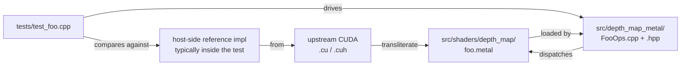

# Adding a new MSL kernel

Step-by-step walkthrough for porting a new CUDA kernel from upstream
`upstream/src/aliceVision/depthMap/cuda/` into our Metal port. The pattern
below is what every kernel from S3 (`eig33`) through S31 (custom patch
pattern, volume Gaussians, adaptive-P2) followed.

## Mental model



## Steps (concrete order)

### 1. Choose a CPU reference

For every kernel we have ported, the test file in `tests/test_<name>.cpp`
contains a **host-side reference implementation** that mirrors the upstream
algorithm in plain C++. The reference is FP64 (so we can quantify FP32
drift) and uses Eigen where the algorithm naturally calls for it.

This is non-negotiable. You cannot validate a kernel against `"the CUDA
version produced X on Linux"` because you don't have a Linux CUDA box.
You validate against a CPU reference in the same TU.

### 2. Write the MSL kernel

Land it in `src/shaders/depth_map/<name>.metal` (one kernel per file is the
norm; multi-kernel files like `volume_kernels.metal` are reserved for tightly
coupled variants).

Conventions:

- Kernel symbol name `av_<name>` — visible from `Device::make_pipeline("av_<name>")`.
- `[[buffer(0)]]` / `[[buffer(1)]]` / etc. ordering must match the host
  `set_buffer()` calls in the matching `Ops.cpp`.
- POD parameter structs go in `[[buffer(N)]]` with `packed_float3` for any
  3-vector that the host C++ also defines. Plain `float3` in MSL is
  16-byte-aligned; `packed_float3` is 12 bytes — matters for layout
  compatibility (`DeviceCameraParams` is 276 B, `DevicePatchPattern` is 868 B,
  validated by `static_assert(sizeof(…))`).
- FP32 only. Apple GPUs have no FP64. Half (`half`) is allowed for storage
  (Refine cost volume), but arithmetic is FP32.

### 3. Add a shared `.h` if other `.metal` translation units will reuse it

Headers like `eig33.h`, `Patch.h`, `color.h`, `SimStat.h`, `matrix.h`,
`volume_helpers.h`, `DevicePatchPattern.h`, `operators.h` are included both
from `.metal` translation units and from the host C++ that builds the
matching CPU reference. Keep them small and dependency-light.

### 4. Add the host driver class

Land it in `src/depth_map_metal/src/<Name>.cpp` +
`include/av/depth_map/<Name>.hpp`. The class:

- Holds an `av::gpu::Pipeline pipeline_` (one per kernel variant).
- Builds it lazily in the ctor via `device.make_pipeline("av_<name>")`.
- Exposes a single-purpose `run(...)` method that constructs a
  `CommandBuffer`, sets the pipeline + buffers + bytes, calls `dispatch`,
  and commits.

Two commit modes:

| Mode | When |
|---|---|
| `commit_and_wait()` | Tests and synchronous code paths. |
| `commit_async(handler)` | Steady-state pipeline where the next dispatch reads the result. |

Multi-dispatch hot paths (like `Volume::optimize`) **batch all dispatches
onto a single command buffer + encoder** and call `commit_and_wait()` once
at the end (S44 perf lesson: ~0.5 ms/dispatch driver overhead on M4
dominates a kernel that takes <1 ms of real GPU work).

### 5. Wire up `cmake/Metal.cmake`

The Metal source list lives in `src/shaders/CMakeLists.txt` under
`av_shaders_sources`. Add your `.metal` file there; the build picks it up
into `default.metallib`.

The host driver belongs in `src/depth_map_metal/CMakeLists.txt` under
`av_depth_map_metal_sources`. Add the `.cpp`.

### 6. Add the test

Land it in `tests/test_<name>.cpp` and register it in `tests/CMakeLists.txt`
via `av_add_test(<name>)`. The test must:

1. Construct an input set with known structure (synthetic plane, random
   matrices with fixed seed, …).
2. Compute the expected result on CPU (your FP64 reference from step 1).
3. Run the GPU kernel via your `<Name>::run(...)`.
4. Compare element-wise. Quantify the worst |err| and assert it is below
   the agreement budget appropriate for the algorithm.

Agreement-budget guidance from prior sessions:

| Kind of arithmetic | Budget |
|---|---|
| FP32-only matrix ops | `1e-5` rel |
| Householder + QL eigenvectors (3×3) | `1e-6` cos deviation |
| NCC with sigmoid invert-and-filter | `5e-2` worst |err| |
| Chained sigmoid (`optimize_depth_sim_map`) | `1e-3` rel sim (FP32-ULP on depth) |
| Clamp-fused thickness | `1e-6` rel (sub-FP32-ULP) |

The chained-sigmoid case is the canonical place where `-ffast-math` requires
a relaxed budget (S23). See [PORTING_NOTES.md §5](https://github.com/placeholder/alicevision-for-mac/blob/main/PORTING_NOTES.md).

### 7. Verify on the build

```bash
cmake --build build
cd build && ctest -R test_<name> --output-on-failure -V
ctest                                  # confirm 37/37 still pass
```

### 8. Wire up an adapter forwarder (only if upstream calls it)

If upstream's host code (`Sgm.cpp`, `Refine.cpp`, etc.) calls into the kernel
via a `cuda_<name>` function, you need a forwarder in
`src/depth_map_metal/src/upstream_adapter.cpp`. **Audit the parameter
pre-processing against the upstream CUDA call site** — this is the S40 bug
class (`memory/mental_note.md` §8i). Specifically: every `* 254.f`,
`1.f + …`, `1.0f / float(…)` that the CUDA caller does before the kernel
must be mirrored on our side. The S41 audit (`memory/adapter_audit_s41.md`)
checks each forwarder against `dSV.cu` line by line — read it as a template.

Wrap the body in `AV_ADAPTER_PROFILE_SCOPE("cuda_<name>")` for profiling
(see [Performance profiling](perf.md)).

## Anti-patterns

- **Don't silently change the parameter range.** If upstream's CUDA caller
  scales `maxSimilarity * 254`, your adapter must too. Don't infer it from
  the parameter name in the struct.
- **Don't use `bool` in MSL ↔ host struct layouts.** Use `int32_t`. MSL
  `bool` is implementation-defined size; the CUDA/host C++/MSL combination
  is fragile. Pattern from `DevicePatchPattern::isCircle` (S31).
- **Don't add a multi-mip `access::read_write` texture kernel** without
  reading `PORTING_NOTES.md §6` — explicit-LOD reads/writes are required
  and we work around it via `DeviceMipmapImage::fill`'s working-texture
  indirection.
- **Don't disable `-ffast-math`** to fix a sub-ULP drift problem.
  Performance-critical code relies on it; relax the test budget instead and
  document the drift case (per §5 of PORTING_NOTES).

## Reference patterns

The cleanest small examples to read first:

- `src/shaders/depth_map/eig33.metal` + `tests/test_eig33.cpp` — single
  kernel, FP64→FP32 port, Householder + QL. (S3.)
- `src/shaders/depth_map/color_kernels.metal` + `src/depth_map_metal/src/ColorOps.cpp`
  + `tests/test_color.cpp` — value type with multiple entry points.
- `src/shaders/depth_map/volume_optimize.metal` +
  `src/depth_map_metal/src/Volume.cpp` (`Volume::optimize`) — the
  best-in-class example of multi-dispatch on a single command buffer (S44).

Larger end-to-end pipelines to read for orchestration patterns:

- `tests/test_sgm_pipeline.cpp` (S14/S15) — SGM core.
- `tests/test_refine_pipeline.cpp` (S18) — Refine.
- `tests/test_depth_pipeline.cpp` (S24) — full SGM → Bridge → Refine →
  Optimize fused.
