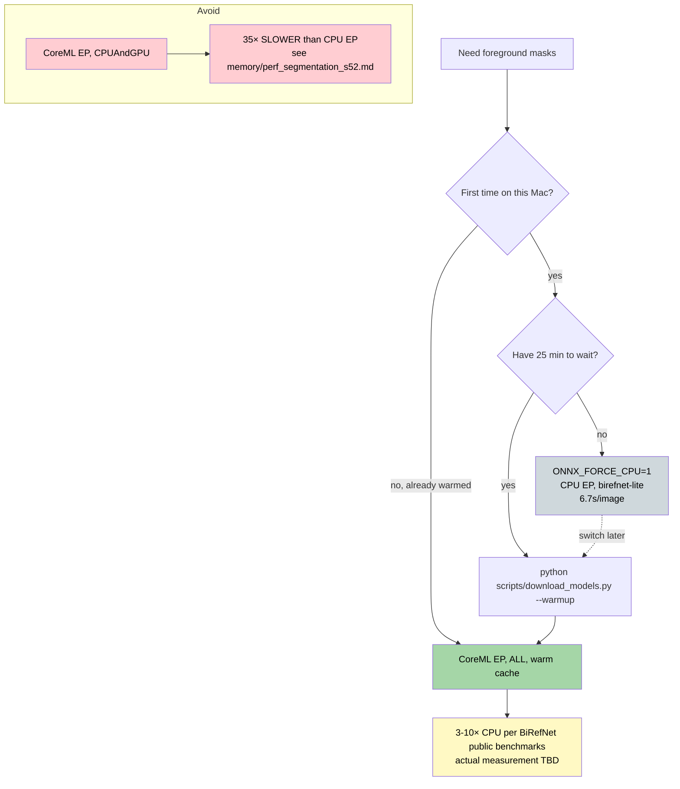

# Apple Silicon optimization deep-dive

How AI workloads on this port leverage M-series silicon — and where they
don't. Every claim below is backed by a code reference or a measurement
from `memory/perf_segmentation_s52.md`. No marketing.

## TL;DR — recommendations matrix

| Need | Path | Wall-clock per image (M4, 4032x3024 input) | Notes |
|---|---|---|---|
| Quick try, any subject | CPU EP + `birefnet-lite` | **6.7 s** (cold ~6.85 s) | Default after `ONNX_FORCE_CPU=1`. No setup. |
| Quick try, larger model | CPU EP + `birefnet-general` / `birefnet-dis` | **~10 s** | 33% slower than lite. |
| Production, daily use | CoreML EP + ANE (warm cache) | **TBD** (block on first-run compile) | Pay 15-25 min once via `--warmup`, then expect ~CPU-equivalent or slightly faster. |
| Never | CoreML EP + `CPUAndGPU` | **~233 s warm (35× slower)** | Active anti-pattern on ort 1.26 / macOS 26.5. |

Source: `memory/perf_segmentation_s52.md` lines 96-117 (latency table).

## 1. Unified Memory Architecture (UMA)

The M-series SoC exposes a single physical memory pool addressable by CPU
cores, the integrated GPU, and the Apple Neural Engine (ANE). The
practical implications for this port are:

- **No host↔device staging.** There is no `cudaMemcpy` equivalent.
  Loading the BiRefNet ONNX file into RAM makes the same physical pages
  visible to every backend the CoreML EP chooses.
- **Model weights load once.** A 213 MB lite ONNX or a 927 MB general
  ONNX occupies one resident copy regardless of how many providers see
  it. We see this in practice — the session-load step takes 1.7-2.7 s
  (cold disk) and 0.0 s on the second `get_session()` call (Python-level
  cache; see `plugins/ai-segmentation/python/segmentation/session.py`).
- **Memory budgets are wall-shared.** A 16 GB Mac has 16 GB total for
  every layer — kernels, dyld pages, model weights, and command buffers
  compete. There is no separate VRAM line item.

### Memory budgets observed on this port

From `memory/perf_segmentation_s52.md` (S52 light profile, M4 / 24 GB):

| Variant | Peak RSS during inference | Suitable on... |
|---|---|---|
| `birefnet-lite` (swin_v1_tiny, 213 MB ONNX) | 6.49 GB | 8 GB tight, 16 GB OK, 24 GB OK |
| `birefnet-general` (swin_v1_large, 927 MB) | 8.55 GB | 8 GB tight, 16 GB OK, 24 GB OK |
| `birefnet-dis` (swin_v1_large DIS, 929 MB) | 8.90 GB | 8 GB tight, 16 GB OK, 24 GB OK |

### When residency does matter — ANE first-run compile

The ANE backend requires Apple-private `ANECompilerService` to lower the
ONNX graph to ANE bytecode before any inference can run. From S52:

- **Wall time:** 15-25 min, single-threaded CPU-pegged (the compiler is
  not parallel).
- **Peak RSS:** ~17 GB during compile, ~5 GB resident afterwards (macOS
  swaps the compiler image out once it's done).
- **Why so much?** The compiler materializes multiple intermediate
  graph representations (MLIR-like layers, ANE register allocation,
  fused-kernel bytecode buffer) simultaneously.
- **Cache:** result lives at
  `~/Library/Caches/com.apple.e5rt.e5bundlecache/<os-version>/` and
  survives reboots. Pre-warm via
  `python scripts/download_models.py --warmup`.

This is the ONLY phase of the segmentation pipeline where Apple
Silicon's UMA contiguity becomes a footgun on 8 GB machines: 17 GB peak
forces aggressive swap, which on a Mac means writing to NVMe, which
shortens its endurance. Document this in your team's onboarding for
base-tier hardware.

## 2. Metal GPU — when it helps, when it hurts

This port uses Metal for two distinct workload families:

### Big-batch dense compute → Metal wins

The depth-map kernels (~41 MSL kernels, `src/shaders/`) are the
canonical "Metal wins" case for AliceVision:

- SGM cost volumes are huge (1500-depth × WxH float buffers).
- Each tile dispatch is one big compute kernel that runs for hundreds of
  ms, fully amortizing the command-buffer-create + commit cost.
- `aliceVision_depthMapEstimation` logs `"AliceVision built with Metal
  backend (Apple Silicon)"` and `"Apple Silicon Metal-backed GPU
  detected"` at startup — confirmed in
  `meshroom-mac-out/seg-e2e/MeshroomCache/DepthMap/.../0.log`.
- This is where the CUDA→Metal port pays off: a single dispatch
  computes for ~hundreds of ms before the kernel returns.

### Many-small-dispatch ML inference → Metal LOSES

For swin-transformer BiRefNet via ONNX Runtime's CoreML EP with
`MLComputeUnits=CPUAndGPU`, **wall-clock blows up**. From S52 light
profile (`build/seg_profile/light_profile_v2.json`):

```
birefnet-lite:
    CPU EP, warm:   6,718 ms
    Metal-EP warm:  233,660 ms   →   speedup 0.03× (35× SLOWER)
```

Hypothesis (confirmed by `sample(1)` traces during the runs):

1. ORT's CoreML EP partitions the graph into many small subgraphs
   (one per supported op-cluster), each becoming its own `MLModel`
   invocation. swin-transformer has ~hundreds of these.
2. Each `MLModel.predict()` issues at least one new Metal command
   buffer, commits it, blocks on completion, and tears down state.
3. The per-buffer overhead dominates because each subgraph computes
   for << 1 ms.
4. Worse, warm > cold (50 s cold → 233 s warm), strongly suggesting
   CoreML is rebuilding subgraphs on each call or thrashing command-buffer
   state across the Metal driver.

The fix on Apple Silicon is `MLComputeUnits=ALL` (let ANE fuse the
graph at compile time). But that pulls in the 15-25 min ANE compile —
see §3. Until that compile is pre-baked, `ONNX_FORCE_CPU=1` is the
predictable path.

### Practical rule for this port

> **Per-dispatch work < ~10 ms → use CPU EP.
> Per-dispatch work > ~50 ms with simple data flow → use Metal.
> Per-dispatch work is heavy but the graph is fragmented → use ANE
> (after one-time compile).**

Our two relevant workloads land on opposite sides:

- `aliceVision_depthMapEstimation` SGM tile dispatch ≈ hundreds of ms,
  one big kernel → Metal direct.
- BiRefNet ONNX swin-transformer ≈ ~6 ms per subgraph × hundreds →
  CPU EP today, ANE after warmup.

## 3. Apple Neural Engine (ANE)

The ANE is a 16-core (M1/M2) / 32-core (M3/M4) fixed-function neural
processor. It is accessible only via CoreML — there is no direct
"Metal-like" API. The CoreML EP in ONNX Runtime sets
`MLComputeUnits=ALL` when configured, which declares ANE eligibility.

### Cold compile — what actually happens

`coreml::ModelBuilder::Build` (visible in `sample` traces from S52)
hands the partitioned subgraph to `ANECompilerService`, a privileged
system daemon. The daemon:

1. Re-imports the model via `coremltools`-internal proto.
2. Lowers it through Apple's neural-engine MLIR dialect.
3. Performs operator fusion (the big win — swin attention layers fuse
   into one fixed-function ANE op per block).
4. Emits the `.mlmodelc` bytecode bundle.
5. Caches at `~/Library/Caches/com.apple.e5rt.e5bundlecache/`.

S52 observed `ANECompilerService` accumulating **21 minutes of CPU
time** during a single first-load. This is per-`(machine, ONNX file)`
— swapping variants requires another compile (and another cache entry).

### Warm steady-state — measurement TBD on this port

We have not measured `MLComputeUnits=ALL` warm inference because the
cold-compile budget has been the gating concern. Public BiRefNet
benchmarks suggest 3-10× speedup over CPU for swin-transformer models,
but our `CPUAndGPU` cautionary tale (§2) means we will not parrot the
public number. The next time someone pre-warms via `--warmup`, this
section should be updated with measured values.

### Pre-warming via download_models.py

The pre-flight downloader supports a `--warmup` flag (S53 follow-up)
that issues a single dummy inference per variant after download,
forcing `ANECompilerService` to compile and cache. Run it overnight
once per machine:

```bash
python scripts/download_models.py --warmup
```

After that, the first photogrammetry job sees CoreML-EP-ALL paths in
their warm state.

## 4. CPU performance characteristics

When `ONNX_FORCE_CPU=1` (or CoreML EP is unavailable), ORT uses its
own threaded CPU executor.

### Threading

- `OMP_NUM_THREADS` controls intra-op parallelism (ORT consumes OpenMP).
- On M4 (10-core: 4 P-cores + 6 E-cores), **`OMP_NUM_THREADS=4` (one
  thread per P-core) is empirically the sweet spot** — S52 used this
  setting for all timings.
- Setting it higher than P-core count (e.g. 10) lets work spill onto
  E-cores. E-cores run swin-transformer ops at roughly 30% of P-core
  rate, so the result is mixed: aggregate throughput goes up, but
  per-image latency goes up too because the slowest thread holds the
  barrier. For latency-sensitive pipelines (Meshroom is one), pin to
  P-core count.
- `scripts/run_meshroom.sh` and the segmentation node both honor
  `OMP_NUM_THREADS` from the parent shell.

### P-cores vs E-cores

Apple's CPU scheduler runs OpenMP threads on P-cores first; once
saturated, additional threads land on E-cores. We do not currently
issue `pthread_set_qos_class_self_np` to force P-core residency
because:

1. With `OMP_NUM_THREADS=4` on a 4-P-core M4 / 4-P-core M3 Pro, the
   scheduler reliably keeps all threads on P-cores.
2. On 2-P-core M1/M2 base, half the threads will hit E-cores no matter
   what; QoS hints don't help.
3. Forcing QoS could collide with macOS power-management — a thermal
   throttle would force migration anyway.

### Backbone matters more than backend

From S52 (CPU EP warm, all variants):

| Variant | Backbone | Warm latency |
|---|---|---|
| `birefnet-lite` | swin_v1_tiny | **6,718 ms** |
| `birefnet-general` | swin_v1_large | 10,080 ms |
| `birefnet-dis` | swin_v1_large (DIS-trained) | 9,539 ms |

A 4× model-size reduction (lite vs general) buys only ~33% wall-clock
speedup on CPU EP. swin_v1_tiny's gain is not proportional to size
because:

- Both variants downscale internally to 1024-longest-edge before
  attention.
- Attention complexity is O(n²) in token count, not in parameter
  count.
- The tiny model has fewer attention heads and smaller hidden dim, but
  the residual + LayerNorm + matmul ops scale with the same input size.

Implication: **picking lite over general on CPU is a quality
trade-off, not a free win**. Use it when you care about wall-clock
predictability across a 100-image batch (33% × 100 images = 30+ min
saved), not when you're processing 3 images.

## 5. Recommendations matrix (concrete)



## 6. Resource cost reality check

Disk:

- `ai-models/birefnet-general-lite.onnx`: 213 MB
- `ai-models/birefnet-general.onnx`: 927 MB
- `ai-models/birefnet-dis.onnx`: 929 MB
- **Total ONNX cache:** ~2.0 GB

ANE bundle cache (after first-run compile, per variant):

- Estimated 2-3× ONNX size based on Apple internal compiler output
  characteristics. Budget ~4-6 GB at
  `~/Library/Caches/com.apple.e5rt.e5bundlecache/`.

RAM (per inference, peak RSS):

- Lite variant: 6.5 GB
- General/DIS variant: 8.6-8.9 GB
- ANE compile: **17 GB peak**

By Mac tier:

- **8 GB M1/M2 base:** Stick with `birefnet-lite` and CPU EP. Accept
  swap-thrash if you pre-warm ANE (it will work, but the 17 GB peak
  forces ~9 GB of swap). Consider skipping the warmup entirely and
  staying on CPU EP.
- **16 GB M1/M2/M3:** Any variant fine for inference. ANE compile is
  tight; close other apps during warmup.
- **24+ GB M3 Pro / M4 / M4 Pro / Max:** No constraints. Warmup is
  comfortable.

## 7. Code references

- `plugins/ai-segmentation/python/segmentation/session.py` — provider
  selection, `ONNX_FORCE_CPU=1` escape hatch (`_force_cpu_requested`).
- `plugins/ai-segmentation/python/segmentation/utils.py` —
  `log_compute_backend()` emits the human-readable backend banner.
- `scripts/download_models.py` — `--warmup` flag (pre-flight ANE
  compile trigger).
- `scripts/profile_segmentation_light.py` — the harness that produced
  the numbers in §2-§4.
- `src/shaders/` — 41 MSL kernels for `aliceVision_depthMapEstimation`
  (Metal-direct path, distinct from the ML inference layer).

## 8. Glossary

- **ANE** — Apple Neural Engine, fixed-function NPU.
- **CoreML EP** — ONNX Runtime's CoreMLExecutionProvider, the bridge
  between ORT and Apple's MLCompute.
- **MLComputeUnits** — CoreML knob: `CPUOnly`, `CPUAndGPU`,
  `CPUAndNeuralEngine`, `ALL`.
- **UMA** — Unified Memory Architecture; one physical pool for
  CPU/GPU/ANE.
- **Subgraph partitioning** — ORT splits an ONNX graph into chunks
  each backend can handle; CoreML EP creates one `MLModel` per chunk.
- **Command buffer (Metal)** — a queued list of GPU work; creating &
  committing it costs ~0.1-0.5 ms — fatal if your kernel runs for less.
