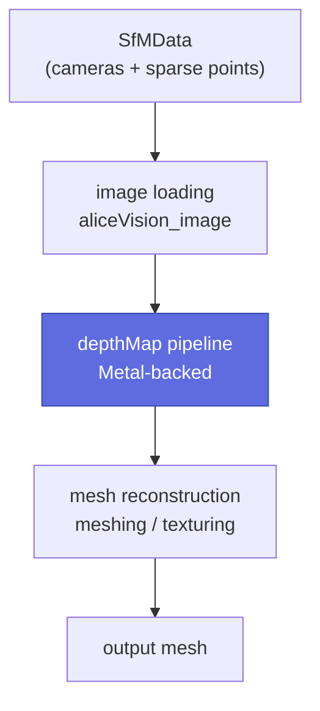

# Architecture

Reader-friendly tour of the codebase. See [Building from source](build.md) if
you want to actually build it; the canonical engineering reference is the
repo-root `ARCHITECTURE.md` which this page distills.

## High-level pipeline



The Metal-backed `depthMap` pipeline contains four nested stages:


The SGM core is `init_sim → compute_similarity → optimize → retrieve_best_depth`;
the Refine pass is `init_refine → refine_similarity → refine_best_depth`. Both
were ported and validated end-to-end on a synthetic plane-induced-homography
scene (S15, S18, S24).

## Repository layout

```
alicevision-for-mac/
├── CMakeLists.txt              root build
├── cmake/
│   ├── Metal.cmake             .metal → .air → .metallib + staging
│   ├── Warnings.cmake
│   ├── UpstreamShim.cmake      Path C; alicevision_add_library shim
│   └── shims/eigen3/           promiscuous Eigen3 5.x → 3.3 bridge
├── src/
│   ├── av_gpu/                 Layer 1 — generic Metal abstraction
│   ├── depth_map_metal/        Layer 2 — depthMap-shaped port
│   └── shaders/depth_map/      MSL kernels + .h shared with host
├── tests/                      37 ctest executables
├── third_party/metal-cpp/      vendored Apple metal-cpp headers
├── third_party/lemon/          vendored LEMON 1.3.1 (graph lib)
├── upstream/                   → read-only AliceVision/Meshroom clone
├── memory/                     engineering memory + session handover
└── build/                      generated
```

## Layer 1 — `av::gpu` (generic Metal abstraction)

Pure metal-cpp; no Objective-C++. Compiles to `libav_gpu.a` (STATIC). The
seven public classes (see `src/av_gpu/include/av/gpu/*.hpp`):

| Class | Role |
|---|---|
| `Device` | RAII handle on a Metal device + default command queue. `Device::default_device()`, `load_library()`, `make_pipeline(name)`. |
| `Queue` | Move-only RAII wrapper around `MTL::CommandQueue`. Multi-queue support added S28 via `DeviceStreamManager`. |
| `Buffer` | RAII handle on `MTL::Buffer`. `Storage::Shared` (default) gives UMA — no `cudaMemcpy`. |
| `Texture` | RAII multi-mip texture with `upload_level()`, `download_level()`, `generate_mipmaps()` (blit). |
| `Pipeline` | Move-only RAII handle on `MTLComputePipelineState`. Built by `Device::make_pipeline(name)`. |
| `CommandBuffer` | Scoped compute encoder. `set_pipeline` / `set_buffer` / `set_bytes` / `set_texture` / `dispatch` / `dispatch_1d`. Commit via `commit_and_wait()` or `commit_async()`. |
| `Errors` | `GpuError` exception. `src/metal_cpp_impl.cpp` emits the metal-cpp private-impl symbols once per binary. |

## Layer 2 — `av::depth_map` (depthMap-shaped port)

Consumes `av::gpu`, exposes AliceVision-flavoured host driver classes.
Compiles to `libav_depth_map_metal.a`. Headers in
`src/depth_map_metal/include/av/depth_map/`:

### Numerical primitives

- **`Eig33`** — Householder + tridiagonal QL on 3×3 symmetric matrices.
  Single MSL kernel `av_eig33_decompose`. Header `eig33.h` is reusable
  from other `.metal` translation units (extracted in S22).
- **`MatrixOps`** — column-major mat-mul, projections, outer product,
  `sigmoid`. Validation kernel `av_matrix_validate`.
- **`PatchOps`** — host mirror of MSL `Patch` + `DeviceCameraParams`
  structs (`packed_float3` for binary compatibility).
- **`ColorOps`** — sRGB EOTF, sRGB→XYZ, XYZ→Lab (with the upstream
  `× 2.55` scaling — see [PORTING_NOTES.md §3](https://github.com/placeholder/alicevision-for-mac/blob/main/PORTING_NOTES.md)),
  HSL, Yoon-Kweon adaptive support weight.
- **`SimStatOps`** — weighted moments + `computeWSim` NCC similarity.

### NCC kernels

- **`CompNCC`** — `compNCCby3DptsYK<TInvertAndFilter>` and the S31
  `compNCCby3DptsYK_customPatchPattern<TInvertAndFilter>`. Four PSO
  variants (filter × pattern flavour).
- **`DevicePatchPattern`** (S31) — host + MSL mirror of the
  layout-stable patch-pattern struct (216 B × 4 subparts + 4 B count = 868 B).

### Image-processing kernels

- **`ImageColorConversion`** — in-place `rgb2lab_kernel`.
- **`GaussianTable`** — host helper that uploads weights/offsets LUTs.
- **`GaussianFilter`** — `downscaleWithGaussianBlur`, `medianFilter3`,
  plus S31 volume-Gaussian kernels.

### Volume kernels

- **`Volume`** — Phase-7 SGM/Refine hot path. Owns 11+ pipelines for
  `init_sim`, `init_refine`, `add_refine`, `update_uninitialized`,
  `compute_similarity`, `retrieve_best_depth`, `refine_similarity`,
  `refine_best_depth`, and the 4 `volume_optimize` sub-kernels.
  `optimize()` takes an optional `const av::gpu::Texture* rc_mipmap` for
  the adaptive-P2 branch (S31).

### DepthSimMap kernels

- **`DepthSimMap`** — 9 SGM/Refine post-processing kernels:
  `copy_depth_only`, `normal_map_upscale`, `smooth_thickness`,
  `compute_sgm_upscaled_depth_pix_size_map` (nearest + bilinear),
  `compute_normal`, `optimize_var_l_of_lab_to_w`,
  `optimize_get_opt_depth_map`, `optimize_depth_sim_map`.

### Host orchestration (Phase 8)

- **`DeviceMipmapImage`** (S26) — wraps a multi-mip `Texture`. The
  working-texture indirection avoids MSL's explicit-LOD requirement on
  multi-mip `access::read_write` textures (see
  [PORTING_NOTES.md §6](https://github.com/placeholder/alicevision-for-mac/blob/main/PORTING_NOTES.md)).
- **`LRUCache<T>` + `CameraPair`** (S27) — header-only template port of
  upstream's slot-stable LRU.
- **`DeviceCache`** (S27) — two `LRUCache` pools: mipmap-images by
  `camera_id`, camera-params by `(camera_id, downscale)`.
- **`DeviceStreamManager`** (S28) — pool of `av::gpu::Queue` instances.

## MSL kernels (`src/shaders/depth_map/`)

Compiled by `cmake/Metal.cmake` into a single `default.metallib` per build,
then staged next to every test + pipeline binary. **35 distinct kernel
entry points across 15 `.metal` files.** Full inventory in
[Reference → Metal kernels](../reference/kernels.md).

## Adapter (Phase 8) — `cuda_*` forwarders

The Metal-side `av::depth_map::*` classes are reached from upstream's
`Sgm.cpp` / `Refine.cpp` / `DepthMapEstimator.cpp` through **15 `cuda_*`
forwarder functions** in `src/depth_map_metal/src/upstream_adapter.cpp`.
Each forwarder is wrapped in `AV_ADAPTER_PROFILE_SCOPE("name")` for
opt-in profiling (see [Performance profiling](perf.md)).

The adapter pattern (one host call → translate types → dispatch Metal kernel
→ wait) is documented in [Adapter pattern](adapter.md). Critical:
**every adapter parameter must mirror the EXACT pre-processing the
upstream CUDA call site does** — the S40 cascade (`memory/mental_note.md`
§8i) was caused by skipping `× 254` and `1.f +` scaling factors.

## Apple Silicon specifics

Decisions that are load-bearing for porting reviewers:

- **UMA storage.** Default `MTLResourceStorageModeShared`. No `cudaMemcpy`
  mental model. `Buffer::data()` returns the same pointer the GPU
  dereferences. Sync happens at the command-buffer boundary.
- **`MTLCommandQueue` per stream.** `DeviceStreamManager` owns a vector of
  `av::gpu::Queue`. `wait_until_completed()` submits a no-op buffer (Metal
  has no direct "queue drain" API).
- **`packed_float3`** for any GPU struct the host C++ also defines. Plain
  `float3` in MSL is 16-byte-aligned; `packed_float3` is 12 bytes.
  `DeviceCameraParams` (276 B) and `DevicePatchPattern` (868 B) are
  byte-compatible across MSL and host.
- **FP32-only kernels.** Apple GPUs have no FP64. Host-side mirrors used by
  CPU reference tests keep FP64 so we can quantify drift. FP16 (`half`)
  appears as the storage type for the Refine cost volume.
- **`access::read_write` on multi-mip textures requires explicit-LOD** —
  our `rgb2lab` kernel uses the implicit form, hence the
  `DeviceMipmapImage::fill` working-texture indirection.
- **`-ffast-math` is the metallib default**, which loosens `exp()` in
  chained sigmoids — relevant for `optimize_depth_sim_map` (S23, relaxed
  agreement budget) and `smooth_thickness` (S20, sub-FP32-ULP drift via
  the `clamp` intrinsic fusion).

Each of these decisions is logged in `PORTING_NOTES.md` at the repo root.
