# Codebase navigation

A one-page guide to the repo layout. Pair this with `ARCHITECTURE.md`
(the deeper system tour) when you need to dive into a specific subsystem.

## Top-level layout

```
alicevision-for-mac/
├── README.md                    Project hero + quick start
├── LICENSE                      MIT (third-party retain their licenses)
├── CONTRIBUTING.md              How to contribute
├── CODE_OF_CONDUCT.md           Contributor Covenant
├── SECURITY.md                  Vulnerability reporting
├── llms.txt                     LLM-readable project digest
│
├── CMakeLists.txt               Root build script (~1180 LOC)
├── mkdocs.yml                   MkDocs Material site config
│
├── ARCHITECTURE.md              System tour (358 LOC)
├── BUILD.md                     Build prerequisites + commands (273 LOC)
├── INSTALL_macOS.md             End-user install (288 LOC)
├── PORTING_NOTES.md             10 CUDA→Metal decisions (427 LOC)
├── RELEASE.md                   Release playbook (S46+)
│
├── src/                         Our overlay code (MIT)
│   ├── av_gpu/                  Metal abstraction over metal-cpp
│   ├── depth_map_metal/         Metal-backed depthMap implementation
│   ├── shaders/                 MSL kernels (~41 .metal files)
│   └── python_shim/             pyalicevision Python stand-in (S42)
│
├── tests/                       C++ unit / integration tests (37 ctest)
│
├── meshroom-native/             SwiftUI native macOS Meshroom replacement
│   ├── Package.swift            SPM manifest
│   ├── Sources/
│   │   ├── ProjectModel/        .mg round-trip (M1)
│   │   └── App/                 Viewer + editor + executor (M2-M9)
│   └── Tests/                   XCTest (151 tests)
│
├── docs/                        MkDocs Material source
│   ├── index.md
│   ├── user/                    End-user pages
│   ├── dev/                     Developer pages (you are here)
│   ├── reference/               CLI / kernel reference
│   ├── changelog.md
│   └── perf-history.md
│
├── cmake/                       CMake support modules
│   ├── Metal.cmake              .metal → .metallib pipeline
│   ├── Warnings.cmake           -W flag policy
│   ├── UpstreamShim.cmake       alicevision_add_library/software shims
│   └── shims/                   Header-only shims for upstream
│       ├── aliceVision-includes/    Replaces CUDA-using upstream headers
│       ├── cuda-stubs/              cuda_fp16.h + cuda_runtime stubs
│       └── eigen3/                  Eigen version-bridge
│
├── patches/                     Upstream patches (NOT modifying upstream/)
│   ├── meshroom/                Mac-specific Meshroom patches
│   └── alicevision-meshroom/    .abc → .sfm/.ply rewrites
│
├── scripts/                     User-runnable helpers
│   ├── run_meshroom.sh          Turn-key Meshroom batch runner
│   ├── aggregate_meshroom_timing.py
│   ├── obj_stats.py
│   └── phase12_install_smoke.sh
│
├── third_party/                 Vendored deps
│   ├── CMakeLists.txt           Build glue
│   ├── lemon/                   COIN-OR LEMON 1.3.1 (tracked, patched)
│   └── metal-cpp/               Apple metal-cpp (NOT tracked; download)
│
├── Formula/                     Homebrew formula
│   └── alicevision-for-mac.rb
│
└── .github/                     Open-source project metadata
    ├── ISSUE_TEMPLATE/
    └── PULL_REQUEST_TEMPLATE.md
```

## Untracked directories (gitignored)

These are needed at dev time but not committed:

```
upstream/             → symlink to ../alicevision-windows/AliceVision (read-only ref)
meshroom-mac/         → local Python Meshroom checkout (regenerate via patches/)
meshroom-mac-out/     → Meshroom pipeline outputs (artefacts)
build/                → CMake build dir
docs-venv/            → MkDocs Python venv
meshroom-venv/        → Meshroom Python venv
dataset_monstree/     → test photos (download per docs/user/pipeline.md)
dataset_middlebury/   → test photos (download per docs/user/pipeline.md)
memory/               → session-handover notes (private; AI-assisted dev)
books/                → reference PDFs (private)
instructions/         → author-local instructions (private)
.claude/              → Claude Code CLI state
```

## How the pieces fit together

```mermaid
graph LR
    A[Raw photos<br/>dataset_monstree/] -->|cameraInit| B[SfMData JSON]
    B -->|featureExtraction| C[features/]
    B -->|imageMatching| D[pairs.txt]
    C & D -->|featureMatching| E[matches/]
    E -->|incrementalSfM| F[sfm.sfm<br/>+ landmarks]
    F -->|prepareDenseScene| G[undistorted EXRs]
    F & G -->|depthMapEstimation<br/>Metal kernels| H[depthMap EXRs]
    H -->|depthMapFiltering| I[filtered EXRs]
    I -->|meshing| J[mesh.obj]
    J -->|meshFiltering| K[smoothed mesh]
    K & G -->|texturing| L[texturedMesh.obj<br/>+ texture PNG]
```



Each arrow above is one of the 12 `aliceVision_*` binaries (from
`build/`). The `depthMapEstimation` step is where our Metal-backed
kernels run — everything else is upstream's CPU code.

## Subsystem entry points

| Want to ... | Start at |
|---|---|
| Add a new MSL kernel | `src/shaders/depth_map/`, then test in `tests/test_*` |
| Optimize an existing kernel | `memory/perf_profile_s43.md` → identify hotspot → `src/depth_map_metal/src/Volume.cpp` for host launcher → `src/shaders/depth_map/*.metal` for the kernel |
| Bridge a new upstream `cuda_*` function | `src/depth_map_metal/src/upstream_adapter.cpp` |
| Add a pipeline binary | `CMakeLists.txt` → search for `aliceVision_depthMapEstimation` block; copy + adapt |
| Improve the native UI | `meshroom-native/Sources/App/` |
| Fix a Meshroom integration issue | `patches/meshroom/` or `patches/alicevision-meshroom/` (Python source; .patch format) |
| Add a doc page | `docs/<section>/<page>.md`; nav in `mkdocs.yml` |
| Add a Homebrew dep | discuss in an issue first, then `CMakeLists.txt` find_package + `Formula/alicevision-for-mac.rb` depends_on |

## Code search tips

```bash
# Find a kernel by MSL function name
grep -rn 'av_volume_compute_similarity' src/

# Find the C++ launcher for that kernel
grep -rn 'compute_similarity' src/depth_map_metal/

# Find the upstream CUDA equivalent (read-only reference)
grep -rn 'volume_computeSimilarity' upstream/src/aliceVision/depthMap/

# Find a CMake target's deps
grep -B 2 -A 20 'add_library(aliceVision_depthMap STATIC' CMakeLists.txt

# Find the Swift type that handles X in the native UI
grep -rn 'MGNode' meshroom-native/Sources/
```

## Documentation index

| Doc | When to read |
|---|---|
| `README.md` | First contact |
| `INSTALL_macOS.md` | Install the binaries |
| `BUILD.md` | Build from source |
| `ARCHITECTURE.md` | Understand the system |
| `PORTING_NOTES.md` | Why CUDA→Metal decisions were made |
| `CONTRIBUTING.md` | Submit a PR |
| `RELEASE.md` | Cut a release |
| `docs/` (MkDocs site) | Comprehensive docs site — run `mkdocs serve` |
| `llms.txt` | If you're an AI agent reading this repo |

## When in doubt

1. Search the repo: `grep -rn '<term>' .` (gitignored paths skipped).
2. Look at recent PRs / commit history for similar changes.
3. Open a discussion. We'd rather you ask than guess wrong.
