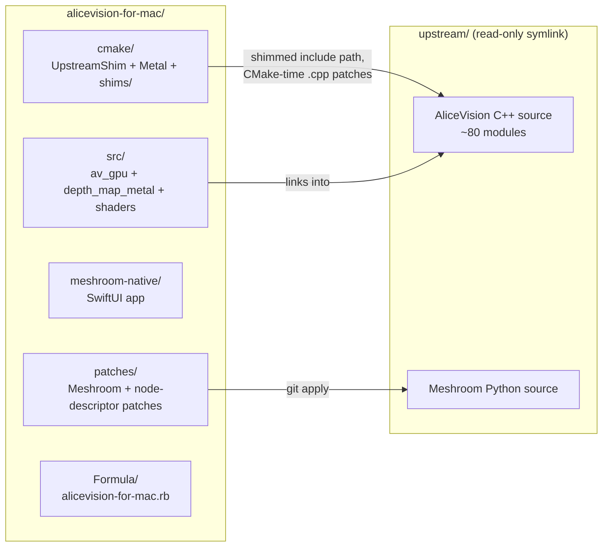
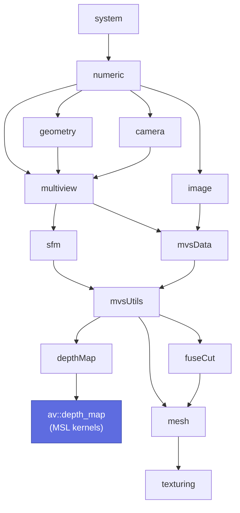
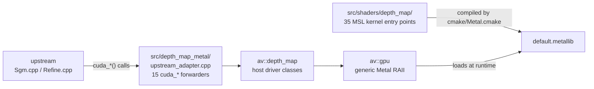

# Project overview

`alicevision-for-mac` is an **out-of-tree overlay** on the upstream AliceVision
photogrammetry framework. The CUDA-bound `depthMap` library is replaced with
a Metal port; everything else is compiled unmodified through a CMake shim.

## Strategy: out-of-tree overlay



The `upstream/` directory is a symlink to a **read-only reference clone** —
never modified on disk. Patches happen at two layers:

1. **CMake-time `file(READ … REPLACE … WRITE …)` patches** for C++ sources
   that don't compile under Apple Clang 21 (the canonical one is
   `multiview/rotationAveraging/l1.cpp`, see
   [PORTING_NOTES.md §10](https://github.com/placeholder/alicevision-for-mac/blob/main/PORTING_NOTES.md)).
   Patched copies land in `build/upstream-patched/`.
2. **Header shims** under `cmake/shims/aliceVision-includes/` that replace
   CUDA-using upstream headers with macOS-native equivalents. The shim path
   is prepended to every upstream module's include path so it wins resolution.

## What's in the repo

```
alicevision-for-mac/
├── CMakeLists.txt              root build; 53 KB (S39 + S41 added the upstream cascade)
├── cmake/
│   ├── Metal.cmake             .metal → .air → .metallib + per-test staging
│   ├── UpstreamShim.cmake      Path C alicevision_add_library shim
│   ├── Warnings.cmake
│   └── shims/                  header shims for CUDA-flavoured upstream headers
├── src/
│   ├── av_gpu/                 generic Metal abstraction
│   ├── depth_map_metal/        depthMap-shaped port (host) + adapter forwarders
│   ├── shaders/depth_map/      MSL kernels (35 entry points across 15 files)
│   ├── cli/                    (reserved for unified `aliceVision` CLI)
│   └── python_shim/            tiny pyalicevision stub
├── tests/                      37 ctest executables
├── meshroom-native/            SwiftUI app (115 tests)
├── meshroom-mac/               working copy of Meshroom with macOS patches applied
├── meshroom-venv/              Python venv for Meshroom runtime
├── patches/meshroom/           4 patches against upstream Meshroom
├── patches/alicevision-meshroom/  2 patches against AliceVision node descriptors
├── scripts/                    run_meshroom.sh, aggregate_meshroom_timing.py, ...
├── Formula/alicevision-for-mac.rb   Homebrew formula
├── third_party/                vendored metal-cpp, vendored LEMON 1.3.1
├── upstream/                   → ../alicevision-windows/AliceVision (symlink)
└── build/                      generated; 12 binaries + 37 tests + default.metallib
```

## Build cascade (Path C)

The "Path C" strategy (from `memory/todo.md` Phase 2) is to enable
`AV_BUILD_UPSTREAM_DEPTHMAP=ON` (now bundled into `AV_BUILD_UPSTREAM=ON`), then
let our `UpstreamShim.cmake` provide the missing `alicevision_add_library` /
`alicevision_add_test` / `alicevision_add_interface` /
`alicevision_add_software` macros so each upstream module compiles in
isolation.

After S41 we compile **32 upstream module subdirectories**:

`system`, `numeric`, `image`, `stl`, `linearProgramming`, `geometry`,
`camera`, `robustEstimation`, `multiview`, `mvsData`, `mvsUtils`, `gpu`,
`feature`, `colorHarmonization`, `lensCorrectionProfile`, `voctree`,
`matching`, `matchingImageCollection`, `imageMatching`, `featureEngine`,
`graph`, `track`, `dataio`, `sfm`, `sfm_bundle`, `sfmMvsUtils`, `depthMap`,
`mesh`, `fuseCut`, `lInfinityCV`, `localization`, `panorama`.

…and link **12 pipeline executables**:

`importMiddlebury`, `cameraInit`, `featureExtraction`, `imageMatching`
(target `_bin`), `featureMatching`, `incrementalSfM`, `prepareDenseScene`,
`depthMapEstimation`, `depthMapFiltering`, `meshing`, `meshFiltering`,
`texturing`.

## Module dependency graph (simplified)



For the full layer tour see [Architecture](architecture.md).

## Where the Metal port lives



The adapter layer is intentionally thin — each `cuda_*` forwarder is 20-50
lines and translates upstream `CudaDeviceMemoryPitched<T, N>` /
`CudaSize<N>` into `av::gpu::Buffer` / dims. See
[Adapter pattern](adapter.md) for the rules every adapter follows.

## Numbers worth knowing

| Metric | Value | Source |
|---|---:|---|
| Pipeline binaries shipped | **12** | S41 `memory/mental_note.md` §8h |
| Metal kernel entry points | **35** across 15 `.metal` files | `src/shaders/depth_map/*.metal` |
| Upstream modules compiled | **32** | S41 |
| `cuda_*` adapter forwarders | **15** | `src/depth_map_metal/src/upstream_adapter.cpp` |
| C++ tests (ctest) | **37/37 pass** | `ctest --test-dir build` |
| Swift tests | **115 pass** | `cd meshroom-native && swift test` |
| Meshroom patches | 4 + 2 | `patches/meshroom/`, `patches/alicevision-meshroom/` |
| Upstream LOC we replaced | ~6000 CUDA C++/.cu → ~2000 MSL + adapter + shims | `memory/mental_note.md` §11 |

## Reading order

1. This page.
2. [Architecture](architecture.md) — layered tour of `av::gpu` /
   `av::depth_map` / MSL kernels.
3. [Building from source](build.md).
4. [Adapter pattern](adapter.md) — read before touching `upstream_adapter.cpp`.
5. [Adding a kernel](adding-kernel.md).
6. [Performance profiling](perf.md).
