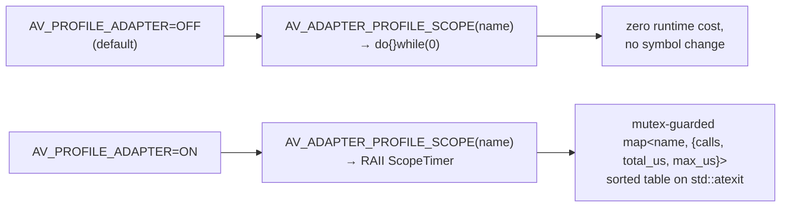

# Performance profiling

The adapter layer ships with an **opt-in per-forwarder timing accumulator**
landed in S43. It is zero-cost when off and produces a sorted table on
process exit when on.

## Mental model



## Enable the profile

```bash
cmake -S . -B build -DAV_PROFILE_ADAPTER=ON
ninja -C build aliceVision_depthMapEstimation
ALICEVISION_ROOT=$PWD/build/alicevision_root \
    ./build/aliceVision_depthMapEstimation \
        -i build/monstree_work/sfm.sfm \
        --imagesFolder build/monstree_work/dense/ \
        -o /tmp/dm_prof \
        --rangeStart 0 --rangeSize 1 \
        2> /tmp/dm_profile.txt
tail -25 /tmp/dm_profile.txt    # sorted per-function table
```

Disable to go back to the default zero-cost path:

```bash
cmake -S . -B build -DAV_PROFILE_ADAPTER=OFF
ninja -C build
```

## What you get

```
Function                                  |   Calls |     Total (ms) |  Mean (ms) |   Max (ms) | % Total
cuda_volumeOptimize                       |       6 |       9161.231 |   1526.872 |   1622.382 | 63.16%
cuda_volumeComputeSimilarity              |      12 |       3487.490 |    290.624 |    479.927 | 24.04%
cuda_volumeRefineSimilarity               |      12 |        810.384 |     67.532 |     87.578 |  5.59%
cuda_depthSimMapOptimizeGradientDescent   |       6 |        512.100 |     85.350 |    142.492 |  3.53%
cuda_volumeRefineBestDepth                |       6 |        270.869 |     45.145 |     58.327 |  1.87%
cuda_volumeInitialize<TSim>               |      12 |        192.632 |     16.053 |     25.671 |  1.33%
cuda_volumeInitialize<TSimRefine>         |       6 |         35.107 |      5.851 |     11.189 |  0.24%
cuda_volumeUpdateUninitializedSimilarity  |       6 |         19.818 |      3.303 |      3.499 |  0.14%
cuda_volumeRetrieveBestDepth              |       6 |          5.835 |      0.973 |      1.058 |  0.04%
cuda_computeSgmUpscaledDepthPixSizeMap    |       6 |          5.492 |      0.915 |      1.708 |  0.04%
cuda_depthThicknessSmoothThickness        |       6 |          3.191 |      0.532 |      2.127 |  0.02%
```

The above is the **S43 baseline** on Monstree mini3 view 0 (M4, 16 GB UMA,
`--rangeSize 1`). Grand total wall time inside adapter: **14,504 ms** across
11 active functions for 6 tiles per view.

## Interpreting the results

For the S43 baseline, the top three bottlenecks were:

1. **`cuda_volumeOptimize` — 9.16 s (63%)**. SGM 4-direction Dynamic
   Programming aggregation. Each tile runs 4 paths with a Y-loop and
   slice-pointer swap. Plus the S31 adaptive-P2 path.
2. **`cuda_volumeComputeSimilarity` — 3.49 s (24%)**. Per-voxel NCC.
   2 calls per tile × 6 tiles.
3. **`cuda_volumeRefineSimilarity` — 0.81 s (5.6%)**. FP16 Refine pass.

The pipeline is **Metal-bound** as expected for MVS. Adapter total ≈
14.5 s vs binary total ≈ 14.9 s, so host-side orchestration is ~3 % of
wall-clock.

## What we did to it (S44, S45)

### S44 — `cuda_volumeOptimize` batching

The four sub-kernels of `Volume::optimize` (`init_y_slice`, `get_xz_slice`,
`compute_best_z`, `aggregate_cost`) were dispatched on separate command
buffers — ~18 000 dispatches per view × ~0.2-0.5 ms driver overhead per
commit = 3.6-9 s of pure latency.

Fix: one command buffer + one encoder + many dispatches + one
`commit_and_wait()` per SGM path (4 total). No kernel changes; Metal's
automatic hazard tracking inserts the right barriers.

Result: **-49.6 %** (9.16 s → 4.62 s). See `memory/perf_optimization_s44.md`.

### S45 — `cuda_volumeComputeSimilarity` threadgroup reshape

The NCC kernel is texture-bandwidth-bound (~81 bilinear samples per voxel).
Adjacent voxels in Z share the same image-space pixel column and differ
only in the depth plane (a slight perspective shift).

Fix: change the dispatch threadgroup from `{16, 4, 1}` (64 threads, 2D) to
`{4, 2, 8}` (64 threads, 3D — stacked in Z). Z-adjacent threads now hit
the same texture cache lines.

Result: **-65.0 %** (3.26 s → 1.14 s). See `memory/perf_optimization_s45.md`.

The threadgroup-shape sweep (14 configs) shows a stark cliff: any 2D shape
(Z=1) is 3200-4600 ms; any shape with Z ≥ 4 drops to 1100-1330 ms.
Z-coherence is the only thing that matters here.

### Post-S45 profile

| Function                                  |   Calls |     Total (ms) | % Total |
|-------------------------------------------|--------:|---------------:|--------:|
| **`cuda_volumeOptimize`**                 |       6 |       4712.2   |  38.2%  |
| `cuda_volumeComputeSimilarity`            |      12 |       1140.1   |   9.2%  |
| `cuda_volumeRefineSimilarity`             |      12 |        789.2   |   6.4%  |
| `cuda_depthSimMapOptimizeGradientDescent` |       6 |        480.0   |   3.9%  |
| `cuda_volumeRefineBestDepth`              |       6 |        265.1   |   2.1%  |

Adapter grand total: ~12.4 s (down from 14.5 s at S43, **-14 %**).

## What's next (S46+)

From `memory/perf_optimization_s45.md` §"Next bottleneck":

1. **`cuda_volumeRefineSimilarity`** (6.4 %) — sibling of
   `cuda_volumeComputeSimilarity`, same NCC-per-voxel pattern. Expected:
   apply `{4, 2, 8}` (or sweep). Quick 50-65 % win → ~300-400 ms.
2. **`cuda_volumeOptimize`** internal kernels — S44 already batched the
   command-buffer overhead out; remaining cost is in `vO_aggregate_cost`
   (~3.5 s) and `vO_compute_best_z` (~3.1 s). Z-coherence trick may not
   apply directly (XZ slices); explicit `threadgroup`-memory tiling of
   the cost-volume access is the candidate.

## Instrumentation internals

| File | Role |
|---|---|
| `src/depth_map_metal/include/av/depth_map/adapter_profile.hpp` | RAII `ScopeTimer` + `AV_ADAPTER_PROFILE_SCOPE(name)` macro. Compiles to `do{}while(0)` when `AV_PROFILE_ADAPTER` is undefined. |
| `src/depth_map_metal/src/adapter_profile.cpp` | Mutex-guarded `unordered_map<const char*, {calls, total_us, max_us}>`; sorted print on `std::atexit` + `~Table()` (atomic guard against double fire). |
| `src/depth_map_metal/src/upstream_adapter.cpp` | One `AV_ADAPTER_PROFILE_SCOPE("...")` line at the top of each of the 15 `cuda_*` forwarders. |
| `src/depth_map_metal/CMakeLists.txt` | Adds the new TUs; gates `-DAV_PROFILE_ADAPTER=1` on the option. |
| `CMakeLists.txt` (top) | `option(AV_PROFILE_ADAPTER "..." OFF)`. |

**Default behaviour with `AV_PROFILE_ADAPTER=OFF`**: macro is `do{}while(0)`,
`adapter_profile.cpp` compiles to an empty TU, no new symbols, ctest 37/37
green.

## Deeper than the adapter

For sub-kernel breakdowns inside a single forwarder, add ad-hoc
`AV_ADAPTER_PROFILE_SCOPE` wrappers around each dispatch block in the
backing host driver. This is how the S44 sub-kernel table for
`Volume::optimize` was generated. The macro is reusable from any TU that
`#include`s `adapter_profile.hpp`.

For external profiling (per-kernel GPU utilization, memory bandwidth, etc.)
attach Instruments → Metal System Trace to the running binary. The Metal
profile gives counters the adapter table can't (queue occupancy, threadgroup
fills, texture-sampler hit rates).

## Aggregate Meshroom timings

`scripts/aggregate_meshroom_timing.py` post-processes Meshroom's per-node
log files into a flat table for cross-run comparison. Useful when you want
end-to-end wall-clock per stage rather than adapter-only timings.
