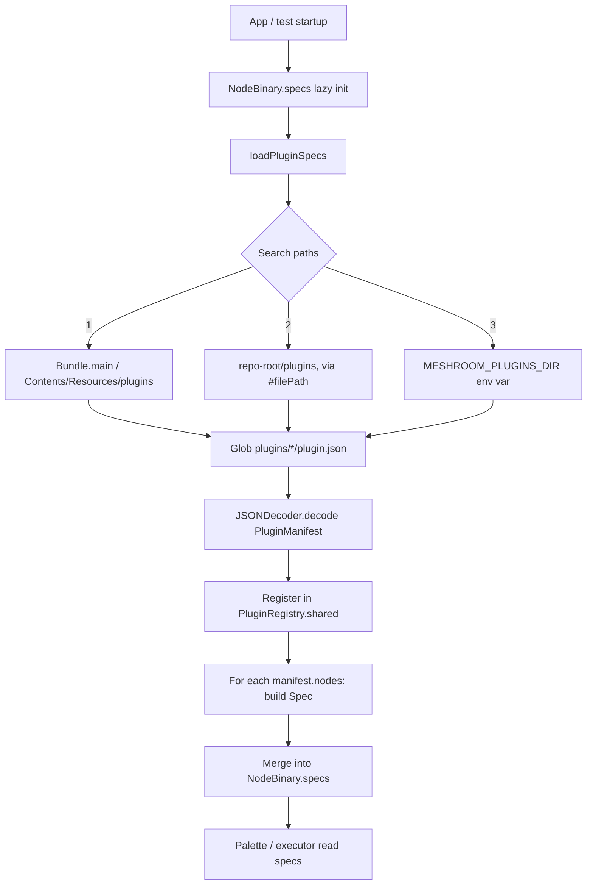

# Plugin system

Status: **S53** — landed as part of the AI-segmentation plugin refactor.

The native Meshroom port supports drop-in plugins that contribute new node
types (Python-backed or wrapped-binary) to the executor and palette via a
declarative `plugin.json` manifest. Plugins live in `plugins/<name>/` and
are auto-discovered at app startup — there is **no** Swift recompile or
manifest edit required to add or remove a plugin.

## Folder layout

```text
plugins/
└── ai-segmentation/                  # one plugin per directory
    ├── plugin.json                   # required: manifest (JSON)
    ├── README.md                     # one-page description for humans
    ├── nodes/
    │   └── aliceVision/
    │       ├── __init__.py           # empty marker — namespace package
    │       └── <NodeName>.py         # one descriptor per node
    ├── python/
    │   └── <package>/                # implementation helpers
    │       ├── __init__.py
    │       └── *.py
    ├── scripts/                      # optional CLI tools (downloaders, ...)
    └── tests/                        # plugin-local pytest tests
```

Multiple plugins coexist: the discovery loop globs `plugins/*/plugin.json`
and merges all of them into `NodeBinary.specs`.

## `plugin.json` schema

The manifest is plain JSON, decoded by `PluginManifest` in
`meshroom-native/Sources/App/NodeBinary.swift`. Required fields are
marked **bold**; everything else is optional.

| Field | Type | Notes |
|-------|------|-------|
| **`name`** | string | Globally unique plugin identifier. Used by the registry. |
| **`version`** | string | Semver-style version. Surfaced in diagnostic UI. |
| **`description`** | string | One-line description shown in any future plugin browser. |
| `license` | string | SPDX identifier — `MIT`, `Apache-2.0`, ... |
| `compute_backends` | string[] | Tags like `["coreml", "metal", "ane", "cpu"]`. Diagnostic only. |
| `models_dir` | string | Path (relative to plugin root) to any model cache the plugin needs. |
| `python` | object | `{venv, nodes_path, package_path, entry_module}`. See below. |
| **`wrapper_script`** | string | Path (relative to plugin root) to the executable shell script the Swift executor will spawn. For Python-only plugins this is `meshroom-native/scripts/run_python_node.sh`. |
| **`nodes`** | array | One entry per node type the plugin contributes. See below. |
| `model_variants` | array | Optional table of model variants exposed via the node's `ChoiceParam`. |

### `nodes[]` entries

| Field | Type | Notes |
|-------|------|-------|
| **`name`** | string | The Meshroom `nodeType` string (matches the `<Name>.py` filename and the Python class name). |
| **`icon`** | string | SF Symbol name shown in the palette. |
| **`category`** | string | Free-form palette grouping label. |
| **`inputs`** | `{name: type}` | Maps attribute names to type tokens recognised by the M8 type-checker: `file`, `int`, `double`, `string`, `bool`, `fileArray`, `intArray`, `stringArray`. |
| **`outputs`** | `{name: type}` | Same vocabulary as `inputs`. Each key becomes a pin on the right edge of the node. |
| `constant_flags` | string[] | Extra argv tokens appended verbatim — used by the Python wrapper script to route to the correct Python node via `--nodeType <Name>`. |
| `parallelization` | object \| null | Reserved for a future plugin contract; currently always `null`. |

## Lifecycle



Resolution order: bundled (`.app/Contents/Resources/plugins/`), dev-mode
(`<repo>/plugins/` discovered from `#filePath`), then environment
override (`$MESHROOM_PLUGINS_DIR`). The **first existing directory**
wins — plugins are not merged across search paths.

## How to write a new plugin

Walkthrough: building a hypothetical `depth-anything-segmentation` plugin.

1. **Create the directory tree.**
   ```bash
   mkdir -p plugins/depth-anything-segmentation/{nodes/aliceVision,python/depth_anything,scripts,tests}
   touch plugins/depth-anything-segmentation/nodes/aliceVision/__init__.py
   touch plugins/depth-anything-segmentation/python/depth_anything/__init__.py
   ```

2. **Write the node descriptor** (`nodes/aliceVision/DepthAnything.py`). This
   is a regular Meshroom `desc.Node` subclass — see
   `plugins/ai-segmentation/nodes/aliceVision/SegmentationBiRefNet.py` for a
   complete reference, including how to bootstrap your `python/` helpers
   onto `sys.path`.

3. **Drop your manifest** at `plugin.json`:

   ```json
   {
     "name": "depth-anything-segmentation",
     "version": "0.1.0",
     "description": "Mono-depth estimation via Depth-Anything ONNX",
     "license": "MIT",
     "compute_backends": ["coreml", "metal", "cpu"],
     "wrapper_script": "../../meshroom-native/scripts/run_python_node.sh",
     "python": {
       "venv": "../../meshroom-venv",
       "nodes_path": "nodes",
       "package_path": "python",
       "entry_module": "meshroom.bin.node_run"
     },
     "nodes": [
       {
         "name": "DepthAnything",
         "icon": "ruler",
         "category": "Utils",
         "inputs": {
           "input": "file",
           "outputResolution": "string",
           "verboseLevel": "string"
         },
         "outputs": { "output": "file" },
         "constant_flags": ["--nodeType", "DepthAnything"],
         "parallelization": null
       }
     ]
   }
   ```

4. **Run the test suite.** Both `pytest plugins/<your-plugin>/tests/`
   and `swift test` should pass. The Swift side discovers your manifest
   automatically — no recompile needed.

5. **Drag the node** from the palette onto the canvas in the running app.
   Connect it like any built-in node.

## Constraints

Plugins MUST be self-contained:

- All Python helpers live in `plugins/<name>/python/`. Do NOT add imports
  to upstream Meshroom packages outside `meshroom.core.desc`.
- All scripts live in `plugins/<name>/scripts/`. Do NOT modify the
  reusable wrapper at `meshroom-native/scripts/run_python_node.sh` —
  that wrapper serves every plugin and must remain untouched.
- Manifests MUST declare every compute backend they expect to use, so a
  future "this plugin requires AMX" filter can refuse to load a plugin
  whose backends the host can't satisfy.
- Do NOT mutate `NodeBinary.coreSpecs` from a plugin. The Swift side
  treats `coreSpecs` as immutable; plugins are merged on top.

## Test conventions

| Layer | Where | What |
|-------|-------|------|
| Manifest | `plugins/<name>/tests/test_plugin_manifest.py` | JSON parses, all referenced paths exist, node names match files on disk. |
| Python helpers | `plugins/<name>/tests/test_*.py` | Unit tests for the package code under `python/`. |
| Swift integration | `meshroom-native/Tests/AppTests/PluginRegistryTests.swift` | Plugin is discovered, `Spec` matches the manifest, palette icon is loaded from manifest. |

The CI loop runs `swift test` plus `python -m pytest tests/python`
against the back-compat symlinks; plugin-local tests can be added to the
ai-segmentation suite or invoked separately via
`python -m pytest plugins/<name>/tests`.

## Reference: the ai-segmentation plugin

The first plugin shipped via this system is `ai-segmentation`, which
provides the `SegmentationBiRefNet` node (rembg + BiRefNet via ONNX
Runtime + CoreML). Read its `plugin.json` and `README.md` as the
canonical example.
