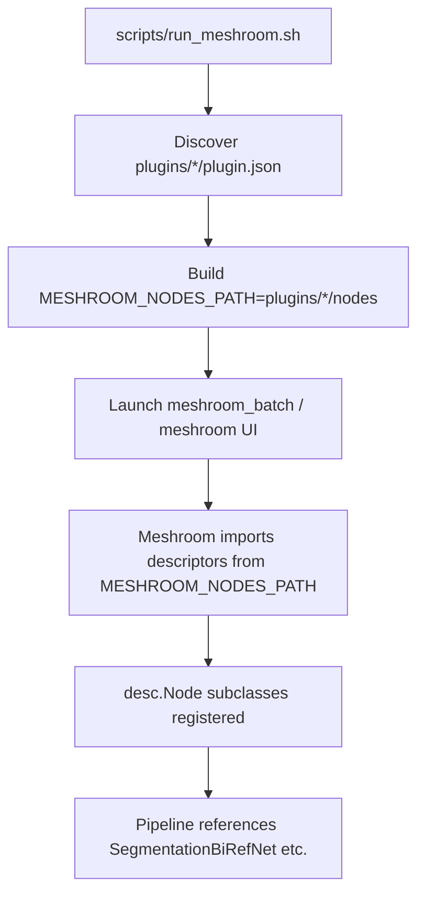

# Plugin system

Status: **S53** — first introduced for the AI-segmentation node; updated
2026-05-23 after the meshroom-native Swift frontend was retired and the
Python Meshroom became the sole frontend.

The Mac port supports drop-in plugins that contribute new Meshroom node
descriptors (Python-backed) via a declarative `plugin.json` manifest.
Plugins live in `plugins/<name>/` and are auto-discovered by Meshroom
through `MESHROOM_NODES_PATH` (set by `scripts/run_meshroom.sh`). The
manifest is also consumed by the plugin-local tests under
`plugins/<name>/tests/`.

## Folder layout

```text
plugins/
└── ai-segmentation/                  # one plugin per directory
    ├── plugin.json                   # required: manifest (JSON)
    ├── README.md                     # one-page description for humans
    ├── nodes/
    │   └── aliceVision/
    │       ├── __init__.py           # empty marker — namespace package
    │       └── <NodeName>.py         # one Meshroom desc.Node per file
    ├── python/
    │   └── <package>/                # implementation helpers
    │       ├── __init__.py
    │       └── *.py
    ├── scripts/                      # optional CLI tools (downloaders, ...)
    └── tests/                        # plugin-local pytest tests
```

Multiple plugins coexist: `scripts/run_meshroom.sh` extends
`MESHROOM_NODES_PATH` with every `plugins/*/nodes` directory it finds.

## `plugin.json` schema

The manifest is plain JSON. Required fields are marked **bold**;
everything else is optional metadata.

| Field | Type | Notes |
|-------|------|-------|
| **`name`** | string | Globally unique plugin identifier. |
| **`version`** | string | Semver-style version. Surfaced in diagnostic output. |
| **`description`** | string | One-line description shown in any future plugin browser. |
| `license` | string | SPDX identifier — `MIT`, `Apache-2.0`, ... |
| `compute_backends` | string[] | Tags like `["coreml", "metal", "cpu"]`. Diagnostic only. |
| `models_dir` | string | Path (relative to plugin root) to any model cache the plugin needs. Resolved against the repo root. |
| `python` | object | `{venv, nodes_path, package_path, entry_module}`. Describes where the Python descriptors and helpers live. |
| **`nodes`** | array | One entry per node type the plugin contributes (mostly diagnostic — Meshroom auto-discovers descriptors via `MESHROOM_NODES_PATH`). See below. |
| `model_variants` | array | Optional table of model variants exposed via the node's `ChoiceParam`. |

### `nodes[]` entries

| Field | Type | Notes |
|-------|------|-------|
| **`name`** | string | Meshroom `nodeType` (matches `<Name>.py` filename + the Python class name). |
| `icon` | string | Free-form icon hint for future UI integrations. |
| `category` | string | Meshroom palette grouping label. |
| `inputs` | `{name: type}` | Documentation of expected attribute names + types. Meshroom itself takes the actual schema from the Python descriptor. |
| `outputs` | `{name: type}` | Same convention. |
| `constant_flags` | string[] | Argv tokens appended verbatim when the node is dispatched via `meshroom.bin.node_run`. |
| `parallelization` | object \| null | Reserved for a future plugin contract. |

## Lifecycle



`scripts/run_meshroom.sh` is the canonical entry point — it sets
`U2NET_HOME=<repo>/ai-models`, `MESHROOM_NODES_PATH`, and
`DYLD_FALLBACK_LIBRARY_PATH` so descriptors find their assets.

## How to write a new plugin

Walkthrough: building a hypothetical `depth-anything-segmentation` plugin.

1. **Create the directory tree.**
   ```bash
   mkdir -p plugins/depth-anything-segmentation/{nodes/aliceVision,python/depth_anything,scripts,tests}
   touch plugins/depth-anything-segmentation/nodes/aliceVision/__init__.py
   touch plugins/depth-anything-segmentation/python/depth_anything/__init__.py
   ```

2. **Write the node descriptor** (`nodes/aliceVision/DepthAnything.py`).
   Regular Meshroom `desc.Node` subclass — see
   `plugins/ai-segmentation/nodes/aliceVision/SegmentationBiRefNet.py` for
   a complete reference, including how to bootstrap your `python/`
   helpers onto `sys.path`.

3. **Drop your manifest** at `plugin.json`:

   ```json
   {
     "name": "depth-anything-segmentation",
     "version": "0.1.0",
     "description": "Mono-depth estimation via Depth-Anything",
     "license": "MIT",
     "compute_backends": ["coreml", "metal", "cpu"],
     "python": {
       "venv": "../../meshroom-venv",
       "nodes_path": "nodes",
       "package_path": "python",
       "entry_module": "meshroom.bin.node_run"
     },
     "nodes": [
       {
         "name": "DepthAnything",
         "icon": "ruler",
         "category": "Utils",
         "inputs": {
           "input": "file",
           "outputResolution": "string",
           "verboseLevel": "string"
         },
         "outputs": { "output": "file" },
         "constant_flags": ["--nodeType", "DepthAnything"],
         "parallelization": null
       }
     ]
   }
   ```

4. **Add a plugin-manifest test** at
   `plugins/depth-anything-segmentation/tests/test_plugin_manifest.py`
   (copy the ai-segmentation one — it just asserts JSON parses, paths
   exist, node names match files). Run:

   ```bash
   python -m pytest plugins/depth-anything-segmentation/tests/
   ```

5. **Drop the node** onto your Meshroom graph after relaunching via
   `bash scripts/run_meshroom.sh`.

## Constraints

Plugins MUST be self-contained:

- All Python helpers live in `plugins/<name>/python/`. Do NOT add imports
  to upstream Meshroom packages outside `meshroom.core.desc`.
- All scripts live in `plugins/<name>/scripts/`.
- Manifests MUST declare every compute backend they expect to use, so a
  future "this plugin requires AMX" filter can refuse to load a plugin
  whose backends the host can't satisfy.

## Test conventions

| Layer | Where | What |
|-------|-------|------|
| Manifest | `plugins/<name>/tests/test_plugin_manifest.py` | JSON parses, all referenced paths exist, node names match files on disk. |
| Python helpers | `plugins/<name>/tests/test_*.py` | Unit tests for the package code under `python/`. |
| Repo-wide smoke | `tests/python/test_pipeline_integration.py` | E2E coverage matrix against shipped binaries. |

The CI loop runs `python -m pytest tests/python`; plugin-local tests can
be invoked separately via `python -m pytest plugins/<name>/tests`.

## Reference: the ai-segmentation plugin

The first plugin shipped via this system is `ai-segmentation`, which
provides the `SegmentationBiRefNet` node. It supports two inference
backends: pre-converted **CoreML `.mlpackage`** files at `ai-models/`
(production path on Apple Silicon, CPU+GPU compute units) and the
**rembg + ONNX Runtime CoreML EP** fallback. Read its `plugin.json` and
`README.md` as the canonical example.
