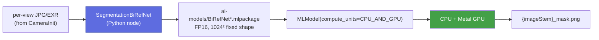
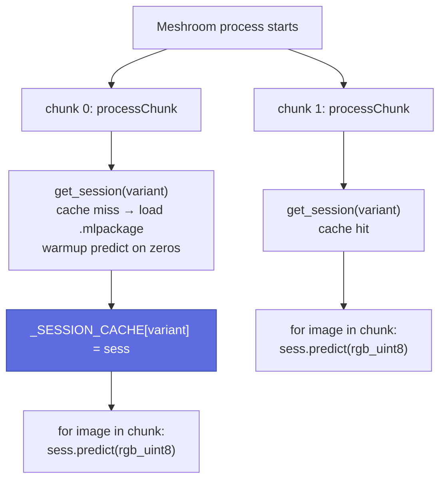

# Segmentation pipeline (dev)

Developer guide for `SegmentationBiRefNet` — the AI segmentation
Meshroom node. The end-user view lives at
[`user/segmentation.md`](../user/segmentation.md).

## Architecture overview

`SegmentationBiRefNet` is a **pure-Python Meshroom plugin** — no CMake
target, no `aliceVision_*` binary, no `cuda_*` adapter forwarder. The
node executes inference in-process by loading a pre-converted FP16
CoreML `.mlpackage` and calling `MLModel.predict`.



The earlier rembg + ONNX Runtime backend was removed 2026-05-23. It was
~10–35× slower than the mlpackage path on Apple Silicon (Metal
command-buffer thrashing in ORT's CoreML EP for swin-v1 graphs) and
its CPU fallback ran at 6–10 s per frame. The plugin is now CoreML-only.

## Where the pieces live

| Path | Role |
|---|---|
| [`plugins/ai-segmentation/nodes/aliceVision/SegmentationBiRefNet.py`](../../plugins/ai-segmentation/nodes/aliceVision/SegmentationBiRefNet.py) | Meshroom `desc.Node` descriptor. `inputs`, `outputs`, `processChunk`. |
| [`plugins/ai-segmentation/python/segmentation/__init__.py`](../../plugins/ai-segmentation/python/segmentation/__init__.py) | `ensure_models_dir()`, repo-root + ai-models constants. |
| [`plugins/ai-segmentation/python/segmentation/session.py`](../../plugins/ai-segmentation/python/segmentation/session.py) | `BiRefNetCoreMLSession`, `get_session(variant)`, `_resolve_package_path`, module-level `_SESSION_CACHE`. |
| [`plugins/ai-segmentation/python/segmentation/utils.py`](../../plugins/ai-segmentation/python/segmentation/utils.py) | `log_compute_backend()`, `coremltools_version()`. |
| [`ai-models/`](../../ai-models/) | Local mlpackage staging. `BiRefNet_lite.mlpackage` + `BiRefNet.mlpackage` live here; git-ignored (large). |
| [`models/`](../../models/) | BiRefNet HF checkpoints (`lite/`, `general/`) + conversion pipeline (`convert/`). |
| [`models/production_note.md`](../../models/production_note.md) | Production-decision document. Read this before changing anything. |
| [`plugin.json`](../../plugins/ai-segmentation/plugin.json) | Plugin manifest. Consumed by `MESHROOM_NODES_PATH` discovery and `tests/test_plugin_manifest.py`. |

The node is discovered by Meshroom via `MESHROOM_NODES_PATH` (set by
`scripts/run_meshroom.sh` from each `plugins/*/nodes/` directory) — the
same mechanism every other Python node uses.

## CoreML mlpackage backend

The pre-converted packages at `ai-models/BiRefNet*.mlpackage` are
generated offline by `models/convert/convert_to_coreml.py`. Conversion
does three load-bearing things:

1. Patches `DeformableConv2d.forward` to a `grid_sample`-based unroll
   (CoreML has no deformable-conv op; numerically identical within
   ~1e-5 abs error on FP16).
2. Traces at fixed `1024×1024` (CoreML's flexible-shape range disables
   most optimizations and bloats compile time — `mlpackage` is shape-locked).
3. Saves an FP16 `mlprogram` `.mlpackage` with
   `compute_units=CPU_AND_GPU` — **mandatory** to skip the doomed ANE
   compile pass at save time.

Full reproducibility recipe in
[`ai-models/README.md`](../../ai-models/README.md). Apple-Silicon
production-decision rationale in
[`models/production_note.md`](../../models/production_note.md).

### Loading at runtime

```python
import coremltools as ct
mlmodel = ct.models.MLModel(
    "ai-models/BiRefNet_lite.mlpackage",
    compute_units=ct.ComputeUnit.CPU_AND_GPU,
)
```

**Never pass `.all` or `.cpuAndNeuralEngine`.** CoreML's planner tries
ANE first, hangs in `com.apple.anef.p3`, and never returns. The session
loader hard-codes `.cpuAndGPU`.

### Preprocessing contract

The `.mlpackage` is shape-locked to `[1, 3, 1024, 1024]` float32 input
and emits `[1, 1, 1024, 1024]` float32 sigmoid output in `[0, 1]`.
`BiRefNetCoreMLSession.predict(image_rgb)` handles:

1. Bilinear resize of source HxWx3 uint8 to 1024×1024 (Pillow).
2. ImageNet normalization in float32 (`mean=[0.485, 0.456, 0.406]`,
   `std=[0.229, 0.224, 0.225]`).
3. `MLModel.predict({"input": arr})`.
4. Bilinear resize of the output mask back to the source `(H, W)`.

The caller (the Meshroom node) does PNG/EXR serialization.

## Inference session lifecycle



Meshroom may call `processChunk` multiple times in the same Python
process. The session cache **must** survive across calls — otherwise
each chunk re-pays the ~3 s (lite) / ~5 s (general) model-load cost plus
the first-predict Metal-pipeline JIT.

## Why the ANE is off the table

Quick summary of [`models/production_note.md`](../../models/production_note.md):

- BiRefNet's `ASPPDeformable` decoder uses deformable convolution v2.
  Dropping deformable behaviour produces visibly broken masks (holes
  inside objects, edge halos) even though binary-mask IoU stays ~0.95.
- CoreML lowers the unrolled deformable conv via ~240 `grid_sample`
  calls per `ASPPDeformable` block.
- The ANE compiler cannot lower `grid_sample` at all. `ANECCompile`
  produces "Error in building plan"; the load call hangs in
  `com.apple.anef.p3`.
- The only way to a fully-on-ANE BiRefNet is to **retrain** the
  `dec_att` blocks as plain `ASPP` (no deformable conv). Out of scope.

The GPU path is fast enough (~350 ms / 1024² frame on `lite`) that this
isn't a battery/thermal limit for our segmentation workload.

## Performance budget (M-series, 1024² fixed, FP16 mlpackage)

| Model | `cpuOnly` | `cpuAndGPU` *(production)* |
|---|---:|---:|
| `BiRefNet_lite.mlpackage` | ~750 ms | **~350 ms** |
| `BiRefNet.mlpackage` | ~2150 ms | **~980 ms** |

Source: `models/production_note.md` (3-iter mean after 2 warm-ups,
single-threaded, no other GPU load). First prediction is slower (~3 s
lite load + first JIT, ~5 s general load + first JIT) — the session
loader does one warmup `predict` on a zero tensor immediately after
load to amortize the JIT cost out of the first real frame.

## How to add another segmentation model

The recommended path is to add another BiRefNet variant via the
existing conversion pipeline.

1. Drop the HF checkpoint into `models/<variant>/model.safetensors`
   (mirroring `models/lite/` or `models/general/`).
2. `python models/convert/convert_to_coreml.py <variant>` — produces
   `models/<variant>/BiRefNet_<variant>.mlpackage`.
3. `python models/convert/validate_coreml.py <variant>` — confirm
   IoU@0.5 ≥ 0.99 vs PyTorch.
4. `cp -R models/<variant>/BiRefNet_<variant>.mlpackage ai-models/`.
5. Add the variant to:
   - `session.py:VARIANT_PACKAGES` (id → `.mlpackage` filename).
   - The node descriptor's `modelVariant` `ChoiceParam.values` list.
   - The manifest's `model_variants` array (id, size_mb, backbone,
     package).
6. Add a row to the [Model variants table](../user/segmentation.md#model-variants).

A non-BiRefNet model (e.g. a different segmentation backbone entirely)
should be a **new plugin** under `plugins/<name>/`, not a new variant of
this one. See [Plugin system](plugin-system.md).

## Profiling segmentation

There is no `AV_PROFILE_ADAPTER`-style instrumentation for this node
(it's outside the C++ adapter layer). Profile from the shell:

```bash
# mlpackage steady-state per compute unit
python models/convert/bench_and_demo.py lite      dataset_monstree/mini3/IMG_1024.JPG
python models/convert/bench_and_demo.py general   dataset_monstree/mini3/IMG_1024.JPG
```

Measured numbers live in `models/production_note.md`.

## Boundary with AliceVision C++

The segmentation node touches **zero CMake targets**, adds **zero CUDA
or PyTorch packages to the C++ build**, and emits files in a format
already understood by downstream nodes (the `_mask.png` convention
from `ImageMasking`). This is an explicit design constraint: AI
inference is kept out of the build graph. If a future change tries to
introduce a C++ `aliceVision_segmentation` binary or `onnxruntime-gpu`,
reject it — there's no win that justifies the build-time complexity.
