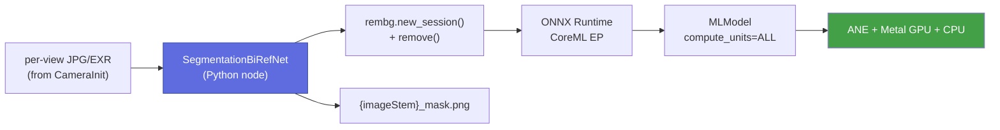
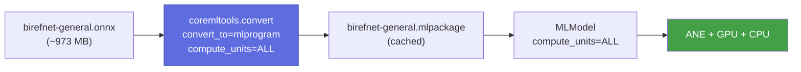
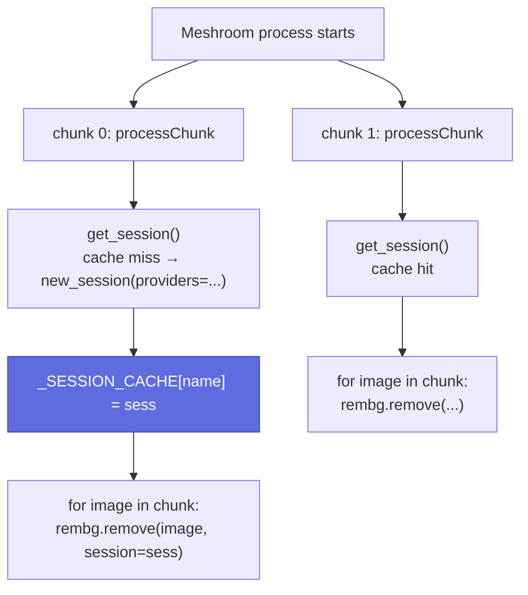

# Segmentation pipeline (dev)

Developer guide for `SegmentationBiRefNet` — the AI segmentation node
added in S50+. The end-user view lives at
[`user/segmentation.md`](../user/segmentation.md); the implementation
specification is `instructions/ai_instruction.md`.

## Architecture overview

`SegmentationBiRefNet` is a **pure Python Meshroom plugin** — no CMake
target, no `aliceVision_*` binary, no `cuda_*` adapter forwarder. The
node executes inference in-process using:

- **`rembg`** (`>=2.0.57`) — session-based model loader; we use its
  `new_session()` + `remove()` API.
- **ONNX Runtime** (`>=1.18.0`) — the standard macOS pip wheel, which
  ships the **CoreML Execution Provider** (`CoreMLExecutionProvider`)
  since v1.16.
- **coremltools** (`>=7.2`) — one-time ONNX → `.mlpackage` conversion at
  first run, cached beside the `.onnx` for re-use.

Inference targets ANE + GPU + CPU via `ct.ComputeUnit.ALL`; graceful
fallback to `CPU_AND_GPU` (Metal only) is logged but never silent.
Source: `instructions/ai_instruction.md` §1, §5–§6.



## Where the pieces live

| Path | Role |
|---|---|
| `meshroom-mac/nodes/aliceVision/SegmentationBiRefNet.py` | Meshroom node definition. Mirrors the `desc.Node` style used by [`ImageMasking.py`](https://github.com/placeholder/alicevision-for-mac/blob/main/meshroom-mac/nodes/aliceVision/ImageMasking.py) — `inputs`, `outputs`, `processChunk`. |
| `meshroom-mac/segmentation/session.py` | `get_session(model_name)` — provider-list construction (`CoreMLExecutionProvider` then `CPUExecutionProvider`), process-level `_SESSION_CACHE` to keep the model warm across chunks. |
| `meshroom-mac/segmentation/convert_to_coreml.py` | One-time `ct.convert(..., convert_to="mlprogram", compute_units=ALL)` with `.mlpackage` caching beside the `.onnx`. |
| `meshroom-mac/segmentation/utils.py` | `log_compute_backend()` (host chip + active EP), `save_mask()` (alpha → PNG/EXR). |
| `scripts/download_models.py` | Pre-flight model downloader. Source URLs in `MODELS` dict. |
| `ai-models/` | Local model cache. `ai-models/README.md` is tracked; model files are gitignored. |

The node is discovered by Meshroom via `MESHROOM_NODES_PATH` (set by
`scripts/run_meshroom.sh`) — same discovery mechanism every other
`meshroom-mac/nodes/aliceVision/*.py` node uses. Source:
`instructions/ai_instruction.md` §1a, §7.

## CoreML conversion flow

ONNX is converted to a CoreML `.mlpackage` (the "mlprogram" path, which
is ANE-eligible — older `neuralnetwork` containers run on GPU/CPU only).
Conversion is cached: the node looks for the `.mlpackage` first and only
falls back to `ct.convert()` on cache miss.



If `ct.convert()` raises on a specific op, the helper falls back to
`compute_units=ct.ComputeUnit.CPU_AND_GPU` (Metal only, no ANE) and
logs a warning. Never falls back silently to CPU-only — that defeats
the point of using CoreML on this host. Source:
`instructions/ai_instruction.md` §5.

## Inference session lifecycle



Meshroom may call `processChunk` multiple times in the same Python
process. The session cache **must** survive across calls — otherwise
each chunk re-pays the ~1 s CoreML model-load cost. Source:
`instructions/ai_instruction.md` §6.

## How to add another segmentation model

The variant table is plumbed in three places. Adding a new model means
touching all three.

1. **`scripts/download_models.py`** — add an entry to the `MODELS`
   dict:

    ```python
    MODELS = {
        # …existing entries…
        "birefnet-massive": (
            "https://huggingface.co/ZhengPeng7/BiRefNet-massive/resolve/main/onnx/…",
            "ai-models/birefnet-massive.onnx",
        ),
    }
    ```

2. **`meshroom-mac/nodes/aliceVision/SegmentationBiRefNet.py`** — add
   the variant name to the `modelVariant` `ChoiceParam.values` list so
   it shows up in the Meshroom inspector.

3. **CoreML conversion sanity check** — run the node once on a test
   image. Some ONNX op-sets fail `coremltools.convert()`. If
   conversion falls back to `CPU_AND_GPU`, log it; if it falls back
   further (or fails outright), the variant is not viable on this
   port — drop it.

4. **Document it** — add a row to the
   [Model variants table](../user/segmentation.md#model-variants) in
   the user guide. License (must be permissive — BiRefNet's family is
   MIT), HuggingFace path, use case, approximate size.

Source: `instructions/ai_instruction.md` §3b, §5.

## Profiling segmentation

There is no `AV_PROFILE_ADAPTER`-style instrumentation for this node
(it's outside the C++ adapter layer). Profile from the shell instead:

```bash
# Single-image timing — separates first-call CoreML conversion
# (~30–60 s) from steady-state inference (~hundreds of ms / view).
time python -c "
from meshroom_mac.segmentation.session import get_session
from rembg import remove
from PIL import Image
sess = get_session('birefnet-general')
img = Image.open('dataset_monstree/mini3/IMG_0001.JPG')
out = remove(img, session=sess)        # first call: includes warmup
"

# Then loop a known set (e.g. Monstree mini3) and divide by N for
# steady-state per-view time.
```

Measured numbers on this port will live in
`memory/perf_segmentation_s52.md` (placeholder until S52 lands).
For the C++ depthMap pipeline equivalent, see
[Performance profiling](perf.md).

## Boundary with AliceVision C++

The segmentation node touches **zero CMake targets**, adds **zero CUDA
or PyTorch packages**, and emits files in a format already understood
by downstream nodes (the `_mask.png` convention from `ImageMasking`).
This was an explicit design constraint — see
`instructions/ai_instruction.md` §9 ("What Not to Do") for the full
banned-imports list. If a future change tries to introduce
`onnxruntime-gpu`, `torch`, or a `aliceVision_segmentation` C++ binary,
reject it: the design intentionally keeps AI inference out of the
build graph.
