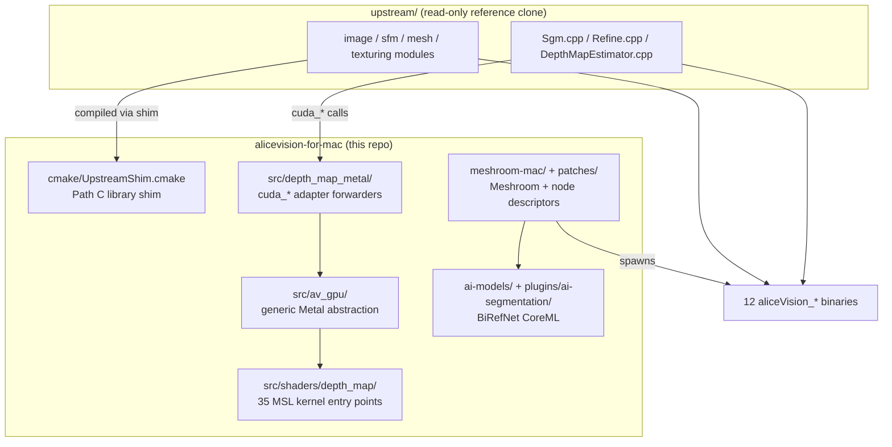

# AliceVision for Mac

**AliceVision photogrammetry + Meshroom on Apple Silicon Metal.**

**60 native ARM64 binaries** covering the full 25-of-25 Meshroom template set.
End-to-end pipeline (raw photos → textured 3D mesh). Drives upstream's PySide6
Meshroom on Apple Silicon. **4 CoreML models** (BiRefNet, YOLOv8n, MoGe-2,
TinyRoMa) integrated for AI inference. Native C++ SWIG bindings replace
load-time Python stubs. Open-source, MPL-2.0.

!!! success "Status (2026-05-24) — feature-complete vs upstream 2026.1.0"
    **60 aliceVision_* binaries** built. **25 of 25 Meshroom templates covered**
    by the pipeline coverage matrix — every binary the templates reference is
    present, every node descriptor is resolved, zero "honest stubs" remain.
    **73 passing pytest** in the always-on suite + 25 skipped (gated heavy E2E).
    4 of those templates are end-to-end-verified on `dataset_monstree/mini3`
    (Draft / Legacy / Object / Turntable). The remaining 21 are
    covered-but-load-only — they need real fixture datasets (HDR brackets,
    calibration spheres, LIDAR e57s, etc.) to be E2E-exercised, not code.

---

## What this is

This repository is an **out-of-tree overlay** on top of the upstream
[AliceVision][av] photogrammetry framework. Apple Silicon has no CUDA, so the
GPU-bound `depthMap` library is re-implemented in Metal Shading Language; the
rest of the upstream tree is compiled unmodified through a CMake shim layer.

[av]: https://github.com/alicevision/AliceVision

The result:

- **60 ARM64-native `aliceVision_*` pipeline binaries**, grouped by area:
  photogrammetry core (11), modern SfM (6), HDR (3), panorama (8), photometric
  stereo (3), camera tracking + utilities (22), LIDAR (3), Mac-port-native
  (3 — `starListing`, `matchMasking`, `moGe`), Middlebury import (1).
  See [Reference → CLI binaries](reference/binaries.md).
- **35 Metal kernel entry points** across 15 `.metal` files in
  `src/shaders/depth_map/`, validated against CUDA reference with FP32-ULP
  agreement on the SGM core. See [Reference → Metal kernels](reference/kernels.md).
- **4 CoreML models** wrapped natively in `src/sphere_detection/`,
  `src/moge/`, `src/roma/` (+ Python plugin for BiRefNet):
    - **BiRefNet** (segmentation) — `cpuAndGPU`, hangs on ANE.
    - **YOLOv8n** (sphere detection) — `.all` (full ANE), 3× faster than GPU.
    - **MoGe-2** (monocular geometry / depth) — `.all` (partial ANE), 1.2× over GPU.
    - **TinyRoMa** (dense matching) — `cpuAndGPU`, 4× slower on ANE due to
      `grid_sample` handoffs (canary for that gotcha).
- **Native C++ SWIG bindings** at `pyalicevision.hdr`, `.sfmData`, `.sfmDataIO`
  — real C++ `estimateGroups()` in `LdrToHdr*` descriptors instead of Python
  stubs returning `[]`. Auto-discovered at import time via `__path__`
  manipulation; falls back to pure-Python stubs when `AV_BUILD_PYALICEVISION=OFF`.
- **Meshroom integration via 4 Darwin patches** + 9 new Mac-port-native
  descriptors (`ScenePreview`, `SegmentationBiRefNet`, `MoGe`, `MatchMasking`,
  `StarListing`, etc.). See [User → Meshroom integration](user/meshroom.md).
- **AI foreground segmentation** via the `SegmentationBiRefNet` Meshroom node
  backed by pre-converted CoreML models in `ai-models/`. See
  [User → Segmentation](user/segmentation.md).

---

## Quick start

=== "Build from source"

    ```bash
    git clone https://github.com/SeedeXR/alicevision-for-mac
    cd alicevision-for-mac
    brew install cmake ninja swig eigen boost ceres-solver openimageio \
        openexr imath libomp pkgconf alembic assimp geogram lemon \
        nanoflann open-mesh opencv onnxruntime
    cmake -S . -B build -G Ninja \
        -DCMAKE_BUILD_TYPE=Release \
        -DAV_BUILD_UPSTREAM=ON -DAV_BUILD_UPSTREAM_DEPTHMAP=ON \
        -DAV_BUILD_PYALICEVISION=ON
    cmake --build build
    ctest --test-dir build              # 37/37 expected
    ```

=== "Run on sample data"

    ```bash
    cd build
    # The 60 binaries are at build/aliceVision_*. Drive them with our
    # Meshroom wrapper script (see User → Meshroom integration):
    ../scripts/run_meshroom.sh python bin/meshroom_batch \
        -i ../dataset_monstree/mini3 \
        -o /tmp/monstree-out \
        -p photogrammetryLegacy
    ```

=== "Always-on tests"

    ```bash
    # Always-on Python tests (no fixture data needed).
    pytest tests/python                  # 73 passed, 25 skipped expected
    ```

=== "AI inference smoke tests (gated)"

    ```bash
    # Real CoreML model inference on a Monstree photo / photo-pair.
    RUN_SEG_E2E=1               pytest tests/python -k segmentation
    RUN_SPHERE_DETECTION=1      pytest tests/python -k sphere_detection
    RUN_MOGE_COREML=1           pytest tests/python -k moge_coreml
    RUN_ROMA_COREML=1           pytest tests/python -k roma_coreml
    ```

---

## Pipeline overview

```mermaid
flowchart LR
    A[Photos<br/>JPG / RAW] --> B[cameraInit]
    B --> C[featureExtraction<br/>SIFT]
    C --> D[imageMatching]
    D --> E[featureMatching]
    E --> F[incrementalSfM]
    F --> G[prepareDenseScene]
    G --> H[depthMapEstimation<br/><i>Metal</i>]
    H --> I[depthMapFiltering]
    I --> J[meshing]
    J --> K[meshFiltering]
    K --> L[texturing]
    L --> M[Textured<br/>3D mesh]

    style H fill:#5e6ce0,stroke:#3949ab,color:#fff
    style M fill:#43a047,color:#fff
    style A fill:#fb8c00,color:#fff
```



The Metal-backed stage is `depthMapEstimation`. Every other stage was already
CPU-only in upstream AliceVision and is compiled directly through the Path C
shim (see [Developer → Project overview](dev/overview.md)).

---

## Architecture at a glance



For the layered view, see [Developer → Architecture](dev/architecture.md).

---

## Where to go next

<div class="grid cards" markdown>

-   :material-account-circle: **End-user**

    ---

    Install the binaries, run the pipeline on your photos.

    [:octicons-arrow-right-24: Installation](user/install.md)

-   :material-code-tags: **Developer**

    ---

    Build from source, add a kernel, profile a hotspot.

    [:octicons-arrow-right-24: Project overview](dev/overview.md)

-   :material-book-open-variant: **Reference**

    ---

    CLI flags, CMake options, MSL kernel inventory.

    [:octicons-arrow-right-24: CLI binaries](reference/binaries.md)

-   :material-history: **History**

    ---

    Session-by-session changelog and perf timeline.

    [:octicons-arrow-right-24: Changelog](changelog.md)

</div>

---

## License & upstreams

This port is MPL-2.0, matching upstream AliceVision. Meshroom is also MPL-2.0.
All Metal kernels, host adapters, the AI segmentation plugin / model
conversion code, and the CMake shim layer are new code original to this
repository; the upstream tree is consumed through a read-only `upstream/`
symlink that is never modified on disk.

Trademarks and project names belong to their respective owners.
