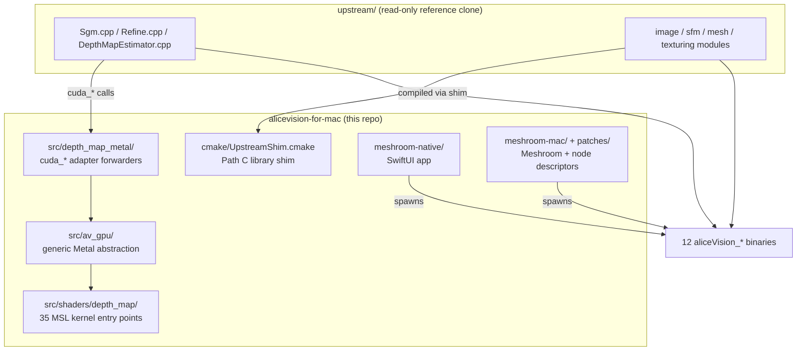

# AliceVision for Mac

**AliceVision photogrammetry + Meshroom on Apple Silicon Metal.**

12 native ARM64 binaries. End-to-end pipeline (raw photos → textured 3D mesh).
Native SwiftUI macOS replacement for Meshroom. Open-source, MPL-2.0.

!!! info "Status (2026-05-20)"
    Full pipeline runs end-to-end on `dataset_monstree/mini3` (3 JPGs @ 4032×3024)
    producing a textured 3D mesh in roughly 1 minute on an M4.
    Validation suite: **37/37 ctest pass** on a clean build. The native SwiftUI
    `meshroom-native` app is at milestone M6 (graph editor with drag-to-connect
    edges) with **115 Swift tests** passing.

---

## What this is

This repository is an **out-of-tree overlay** on top of the upstream
[AliceVision][av] photogrammetry framework. Apple Silicon has no CUDA, so the
GPU-bound `depthMap` library is re-implemented in Metal Shading Language; the
rest of the upstream tree is compiled unmodified through a CMake shim layer.

[av]: https://github.com/alicevision/AliceVision

The result:

- **12 ARM64-native `aliceVision_*` pipeline binaries** —
  `cameraInit`, `featureExtraction`, `imageMatching`, `featureMatching`,
  `incrementalSfM`, `prepareDenseScene`, `depthMapEstimation`,
  `depthMapFiltering`, `meshing`, `meshFiltering`, `texturing`,
  `importMiddlebury`. See [Reference → CLI binaries](reference/binaries.md).
- **35 Metal kernel entry points** across 15 `.metal` files in
  `src/shaders/depth_map/`, validated against CUDA reference with FP32-ULP
  agreement on the SGM core. See [Reference → Metal kernels](reference/kernels.md).
- **Meshroom integration via 4 Darwin patches** that add macOS support to
  upstream Meshroom without modifying its tree. See
  [User → Meshroom integration](user/meshroom.md).
- **Native SwiftUI Meshroom replacement** (`meshroom-native/`) that reads
  Meshroom's `.mg` project files losslessly and runs the same `aliceVision_*`
  binaries through a Swift `Process` orchestrator. See
  [User → Native macOS UI](user/native-ui.md).

---

## Quick start

=== "Build from source"

    ```bash
    git clone <this-repo> alicevision-for-mac
    cd alicevision-for-mac
    brew install cmake ninja eigen boost ceres-solver openimageio openexr \
        imath libomp pkgconf alembic assimp geogram lemon nanoflann \
        onnxruntime open-mesh
    cmake -S . -B build -G Ninja \
        -DCMAKE_BUILD_TYPE=Release \
        -DAV_BUILD_UPSTREAM=ON -DAV_BUILD_UPSTREAM_DEPTHMAP=ON
    cmake --build build
    ctest --test-dir build              # 37/37 expected
    ```

=== "Run on sample data"

    ```bash
    cd build
    # The 12 binaries are at build/aliceVision_*. Drive them with our
    # Meshroom wrapper script (see User → Meshroom integration):
    ../scripts/run_meshroom.sh python bin/meshroom_batch \
        -i ../dataset_monstree/mini3 \
        -o /tmp/monstree-out \
        -p photogrammetryLegacy
    ```

=== "Native SwiftUI app"

    ```bash
    cd meshroom-native
    swift test                          # 115 tests expected to pass
    swift run MeshroomNativeApp         # launches the SwiftUI app
    ```

---

## Pipeline overview


The Metal-backed stage is `depthMapEstimation`. Every other stage was already
CPU-only in upstream AliceVision and is compiled directly through the Path C
shim (see [Developer → Project overview](dev/overview.md)).

---

## Architecture at a glance



For the layered view, see [Developer → Architecture](dev/architecture.md).

---

## Where to go next

<div class="grid cards" markdown>

-   :material-account-circle: **End-user**

    ---

    Install the binaries, run the pipeline on your photos.

    [:octicons-arrow-right-24: Installation](user/install.md)

-   :material-code-tags: **Developer**

    ---

    Build from source, add a kernel, profile a hotspot.

    [:octicons-arrow-right-24: Project overview](dev/overview.md)

-   :material-book-open-variant: **Reference**

    ---

    CLI flags, CMake options, MSL kernel inventory.

    [:octicons-arrow-right-24: CLI binaries](reference/binaries.md)

-   :material-history: **History**

    ---

    Session-by-session changelog and perf timeline.

    [:octicons-arrow-right-24: Changelog](changelog.md)

</div>

---

## License & upstreams

This port is MPL-2.0, matching upstream AliceVision. Meshroom is also MPL-2.0.
All Metal kernels, host adapters, the SwiftUI app, and the CMake shim layer
are new code original to this repository; the upstream tree is consumed
through a read-only `upstream/` symlink that is never modified on disk.

Trademarks and project names belong to their respective owners.
