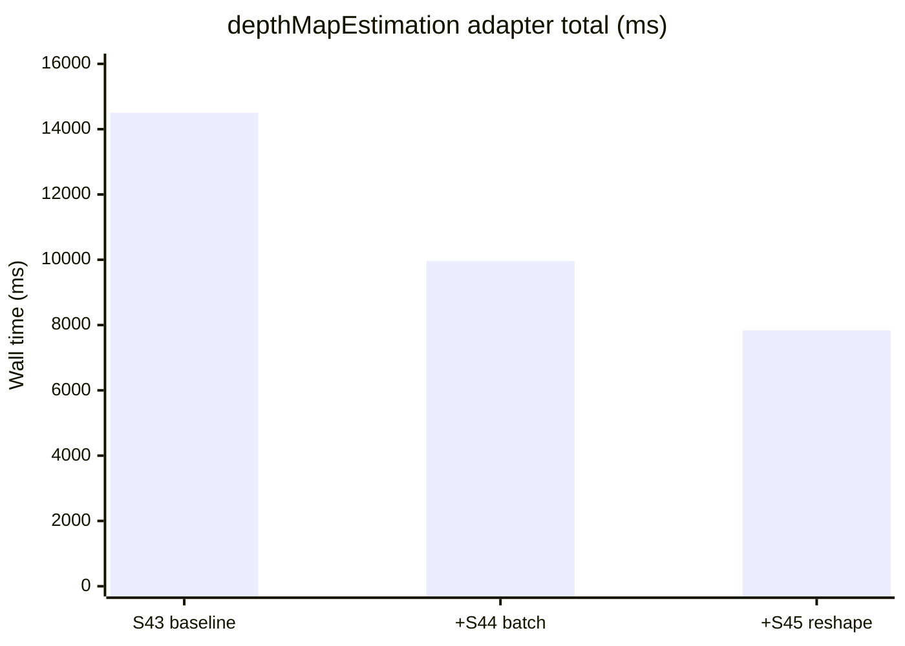
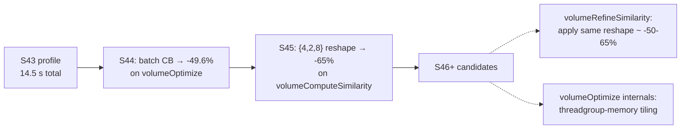

# Performance history

Timeline of optimization wins. Numbers from the M4 (16 GB UMA) profile runs
on `dataset_monstree/mini3/` view 0 with `AV_PROFILE_ADAPTER=ON`,
`--rangeSize 1`. See [Performance profiling](dev/perf.md) for how to
reproduce.

## Wall-clock per session

The numbers below are adapter-grand-total wall time per view. The actual
process wall-clock is ~3% above this (host orchestration overhead).

| Session | Optimization | Adapter total (ms) | Δ vs prior | Cumulative |
|---|---|---:|---:|---:|
| S43 | baseline | 14,504 | — | — |
| S44 | `volumeOptimize` command-buffer batching | 9,959 | **-31.3 %** | -31.3 % |
| S45 | `volumeComputeSimilarity` threadgroup reshape | 7,838 | **-21.3 %** | -45.9 % |

A 45.9% cumulative reduction in adapter wall-time on the production
Monstree mini3 view, with **zero algorithmic changes** — every optimization
preserved bit-exact kernel logic.

## Per-forwarder breakdown

### S43 baseline

| Function | Calls | Total (ms) | Mean (ms) | % Total |
|---|--:|--:|--:|--:|
| `cuda_volumeOptimize` | 6 | 9,161 | 1,527 | **63.16 %** |
| `cuda_volumeComputeSimilarity` | 12 | 3,487 | 291 | **24.04 %** |
| `cuda_volumeRefineSimilarity` | 12 | 810 | 67 | 5.59 % |
| `cuda_depthSimMapOptimizeGradientDescent` | 6 | 512 | 85 | 3.53 % |
| `cuda_volumeRefineBestDepth` | 6 | 271 | 45 | 1.87 % |
| `cuda_volumeInitialize<TSim>` | 12 | 193 | 16 | 1.33 % |
| `cuda_volumeInitialize<TSimRefine>` | 6 | 35 | 6 | 0.24 % |
| `cuda_volumeUpdateUninitializedSimilarity` | 6 | 20 | 3 | 0.14 % |
| `cuda_volumeRetrieveBestDepth` | 6 | 6 | 1 | 0.04 % |
| `cuda_computeSgmUpscaledDepthPixSizeMap` | 6 | 5 | 1 | 0.04 % |
| `cuda_depthThicknessSmoothThickness` | 6 | 3 | 0.5 | 0.02 % |

### Post-S45

| Function | Calls | Total (ms) | % Total | Δ vs S43 |
|---|--:|--:|--:|--:|
| **`cuda_volumeOptimize`** | 6 | 4,712 | **38.2 %** | **-48.6 %** |
| `cuda_volumeComputeSimilarity` | 12 | 1,140 | 9.2 % | **-67.3 %** |
| `cuda_volumeRefineSimilarity` | 12 | 789 | 6.4 % | -2.6 % |
| `cuda_depthSimMapOptimizeGradientDescent` | 6 | 480 | 3.9 % | -6.2 % |
| `cuda_volumeRefineBestDepth` | 6 | 265 | 2.1 % | -2.2 % |

## S44 — `volumeOptimize` command-buffer batching

Per-sub-kernel S44 baseline (before the batching fix):

| Sub-kernel | Calls | Total (ms) | Mean (ms) |
|---|--:|--:|--:|
| `vO_aggregate_cost` | 6,120 | 3,478 | 0.568 |
| `vO_compute_best_z` | 6,120 | 3,145 | 0.514 |
| `vO_get_xz_slice` | 6,144 | 2,344 | 0.382 |
| `vO_init_y_slice` | 24 | 8.6 | 0.359 |

Each sub-kernel takes <1 ms of GPU work per dispatch; with ~18,000
dispatches per view, command-buffer commit overhead (~0.2-0.5 ms each)
dominated.

The fix: one `MTL::CommandBuffer` + one compute encoder per SGM path
instead of one per dispatch. Metal's automatic hazard tracking handles
the read-after-write dependencies on `slice_a`/`slice_b`, `axis_acc`,
and `out_volume` for free.

No kernel source changes. No threadgroup size changes. The DP loop
ordering, slice ping-pong, and filtering-index aggregation are
byte-identical.

## S45 — `volumeComputeSimilarity` threadgroup reshape

The kernel is **texture-bandwidth-bound** (~81 bilinear samples per voxel
from R + T textures). Adjacent voxels in Z sample nearly identical (u, v)
coordinates with only a perspective shift.

Threadgroup-shape sweep (all 64 threads unless noted):

| Threadgroup | Threads | Total (ms) | vs baseline |
|---|--:|--:|--:|
| `{16, 4, 1}` (baseline) | 64 | 3,259.6 | — |
| `{32, 4, 1}` | 128 | 3,639.9 | +11.7 % |
| `{32, 1, 1}` | 32 | 4,508.6 | +38.3 % |
| `{32, 2, 1}` | 64 | 4,073.3 | +24.9 % |
| `{64, 1, 1}` | 64 | 4,572.9 | +40.3 % |
| `{8, 8, 1}` | 64 | 3,224.4 | -1.1 % |
| `{4, 4, 4}` | 64 | 1,329.4 | **-59.2 %** |
| `{4, 4, 8}` | 128 | 1,146.6 | **-64.8 %** |
| `{4, 4, 16}` | 256 | 1,161.5 | **-64.4 %** |
| `{2, 4, 8}` | 64 | 1,127.7 | **-65.4 %** |
| **`{4, 2, 8}` ★** | 64 | 1,106.2 | **-66.1 %** |
| `{8, 2, 8}` | 128 | 1,153.6 | -64.6 % |
| `{2, 2, 8}` | 32 | 1,170.3 | -64.1 % |
| `{2, 2, 16}` | 64 | 1,181.3 | -63.8 % |

The cliff is stark: **any 2D shape (Z=1) is 3,200-4,600 ms; any shape
with Z ≥ 4 drops to 1,100-1,330 ms**. Z-coherence is the only thing that
matters; XY shape within the Z≥4 family barely moves the needle (3 %
spread).

Shipped value: `{4, 2, 8}` (line ~399 of `Volume.cpp`,
`compute_similarity`).

## Why the wins compounded

- S44 was **dispatch-overhead-bound** — a Metal-driver-IPC issue. The fix
  is structural (single command buffer); no kernel work needed.
- S45 was **texture-bandwidth-bound** — a memory-hierarchy issue. The
  fix is a one-line threadgroup-shape change.

These are independent bottleneck classes — fixing S44 freed up GPU time
that `compute_similarity` was previously waiting for in idle Metal-driver
time, and reshaping `compute_similarity` then exposed `volumeOptimize`'s
internal aggregate-cost / compute-best-z costs as the next ceiling.

## What hasn't been touched

- **`cuda_volumeRefineSimilarity` (6.4 %, 789 ms, 12 calls, 65 ms mean)**.
  Sibling of `compute_similarity`; the exact same Z-coherent threadgroup
  reshape should apply. Tracked as S48-R4 (S48 task #95).
- **`cuda_volumeOptimize` internals** (38.2 %, 4.7 s). S44 already batched
  the command-buffer overhead out; remaining cost is in `vO_aggregate_cost`
  (~3.5 s) and `vO_compute_best_z` (~3.1 s). Z-coherence trick doesn't
  apply directly (XZ slices), but explicit `threadgroup`-memory tiling
  of the cost-volume access is the candidate.
- **`simd_sum` for the NCC inner loop**. Threadgroup-shape alone exceeded
  the S45 target (-65 % vs -20-40 %). A `simd_sum` restructure would be
  100+ LOC of kernel rewrite for single-digit-percent additional gains —
  parked.

## Methodology

- **One change at a time**, sample 3-5 runs, take the median.
- **Always run `ctest -j8`** after a change — 37/37 must remain green.
- **Sanity-check the live depth map** afterwards (`Min`, `Max`, `Avg` on
  the valid region) to catch silent numerical regression.

The full per-session writeups (with the threadgroup-sweep tables, the
sub-kernel breakdowns, and the rationale) live in
`memory/perf_optimization_s44.md` and `memory/perf_optimization_s45.md`.
