# CLI binaries

**60 ARM64 native `aliceVision_*` binaries** ship with the release tarball /
Homebrew formula, covering every node referenced by the upstream 2026.1.0
Meshroom template set. All preserve the upstream AliceVision CLI surface
unchanged (no renamed flags). For per-flag detail use `-h` on the
binary itself; this page summarizes what each one does and how it fits the
pipeline.

The classic 11-binary photogrammetry chain below is the original Phase 1
scope. The other 49 binaries (modern SfM, HDR, panorama, photometric stereo,
LIDAR, camera tracking, utilities, Mac-port-native ML wrappers) were added
in Phases 14.1–14.9.

## Pipeline order — classic photogrammetry chain

```mermaid
flowchart LR
    A[cameraInit] --> B[featureExtraction]
    B --> C[imageMatching]
    C --> D[featureMatching]
    D --> E[incrementalSfM]
    E --> F[prepareDenseScene]
    F --> G[depthMapEstimation]
    G --> H[depthMapFiltering]
    H --> I[meshing]
    I --> J[meshFiltering]
    J --> K[texturing]

    style G fill:#5e6ce0,stroke:#3949ab,color:#fff
```

`importMiddlebury` is an offline-dataset ingest helper used outside the
hot path.

## The 12 binaries

### `aliceVision_cameraInit`

Builds the initial `SfMData` (`cameraInit.sfm`) from a directory of images.
Reads EXIF for focal length + sensor; looks up `cameraSensors.db` for the
physical sensor size.

| Input | Output | Notes |
|---|---|---|
| Image folder | `cameraInit.sfm` (JSON SfMData) | EXIF-driven focal-length init |

### `aliceVision_featureExtraction`

Per-view SIFT feature detection + description. CPU-only on Apple Silicon
(vlsift) — the GPU SIFT path requires CUDA.

| Input | Output | Notes |
|---|---|---|
| `cameraInit.sfm` | `features/` (per-view .feat + .desc) | ~20K SIFT features/view typical |

### `aliceVision_imageMatching`

Selects which image pairs to attempt matching. Modes: `Exhaustive`,
`SequentialAndVocabularyTree`, etc.

| Input | Output | Notes |
|---|---|---|
| `cameraInit.sfm`, features | `imageMatches.txt` | exhaustive for small N (3 imgs → 3 pairs) |

!!! note "Target rename"
    The upstream `imageMatching` library and executable both have target name
    `aliceVision_imageMatching` — CMake forbids the collision. Our build
    renames the executable target to `aliceVision_imageMatching_bin` with
    `OUTPUT_NAME aliceVision_imageMatching` so the on-disk filename matches
    Meshroom's expectation (see `memory/mental_note.md` §8d).

### `aliceVision_featureMatching`

Per-pair geometric matching + verification (RANSAC against fundamental /
essential matrix model).

| Input | Output | Notes |
|---|---|---|
| `cameraInit.sfm`, features, image pairs | `matches/` | ~11.5K geometric matches on Monstree mini3 |

### `aliceVision_incrementalSfM`

Bundle-adjusted Structure-from-Motion. Computes cameras + sparse 3D
landmarks.

| Input | Output | Notes |
|---|---|---|
| matches | `sfm.sfm` | 3 cameras + 7.4K landmarks on Monstree mini3 |

### `aliceVision_prepareDenseScene`

Per-view undistortion. Produces `.exr` images aligned with the SfM
calibration.

| Input | Output | Notes |
|---|---|---|
| `sfm.sfm` | `dense/` (one EXR per view) | EXR allows HDR intermediate |

### `aliceVision_depthMapEstimation` :material-lightning-bolt:

**The Metal-backed step.** SGM + Refine + Optimize multi-view stereo. Calls
through the 15 `cuda_*` adapter forwarders into our MSL kernels.

| Input | Output | Notes |
|---|---|---|
| `sfm.sfm` + `dense/` | `depthmaps/<viewID>_depthMap.exr` + `_simMap.exr` | ~12 s / view at 4032×3024 on M4 (S43); ~7.8 s after S44+S45 optimizations |

The `-2` value in `_depthMap.exr` is the alpha-mask sentinel for image-border
pixels.

### `aliceVision_depthMapFiltering`

Per-pixel depth refinement (consistency check, hole fill, normal-driven
smoothing).

| Input | Output | Notes |
|---|---|---|
| `depthmaps/` | `depthmap_filtered/` | ~1 s on the Monstree mini3 depth maps |

### `aliceVision_meshing`

Depth maps → 3D mesh via Delaunay-triangulated fuseCut + GraphCut visibility.

| Input | Output | Notes |
|---|---|---|
| `sfm.sfm`, `depthmap_filtered/` | `dense.sfm`, `mesh.obj` | 7.8K verts / 15.4K faces on Monstree mini3 |

!!! warning "Output format"
    `--output foo.abc` errors with *"AliceVision is built without Alembic
    support."* — macOS doesn't link Alembic. Use `.sfm` (dense SfMData JSON)
    or `.ply` instead. Source: `memory/mental_note.md` §8h-i.

### `aliceVision_meshFiltering`

Laplacian smoothing + non-manifold cleanup.

| Input | Output | Notes |
|---|---|---|
| `mesh.obj` | smoothed `mesh.obj` | 7.7K verts post-smoothing on Monstree mini3 |

### `aliceVision_texturing`

UV unwrap + texture atlas baking. Per-camera reprojection with multi-band
frequency contribution.

| Input | Output | Notes |
|---|---|---|
| dense `.sfm` + mesh | `texturedMesh.obj` + `.mtl` + PNG atlas | 8192² PNG atlas on Monstree mini3 (~192 MB) |

!!! warning "Two flags you'll forget"
    1. Input is the **dense `.sfm`** (from meshing's `--output`), not the
       `.ply` point cloud.
    2. Default `--colorMappingFileType=none` skips actual baking — pass
       `png` / `jpg` / `tif` / `exr` to bake. Source:
       `memory/mental_note.md` §8h-ii.

### `aliceVision_importMiddlebury`

Helper to ingest Middlebury MVS dataset `.par` files (calibrated camera
matrices) into an `SfMData`. Note that Middlebury `.par` files have no
landmarks; you still need the SfM cascade to produce them — see
`memory/mental_note.md` §7g.

| Input | Output | Notes |
|---|---|---|
| Middlebury `.par` + images | `cameraInit.sfm` | cameras + poses only (no landmarks) |

## Runtime environment

All 12 binaries expect:

| Variable | Purpose |
|---|---|
| `ALICEVISION_ROOT` | Path to install prefix; `share/aliceVision/{config.ocio,cameraSensors.db,luts/}` resolved from here. |
| `ALICEVISION_BIN_PATH` | (Meshroom-only) where Meshroom finds the binaries. |
| `default.metallib` (next to binary) | Loaded via `@executable_path`; auto-staged by CMake. |

Set via `scripts/run_meshroom.sh` for Meshroom-driven runs. See
[User → Running the pipeline](../user/pipeline.md) for direct invocation
examples.

## Python-only nodes (not binaries)

### `SegmentationBiRefNet`

!!! note "Listed here for completeness"
    `SegmentationBiRefNet` is a **Python Meshroom node**, not an
    `aliceVision_*` CLI binary. It executes in-process via
    `rembg` + ONNX Runtime (CoreML EP) — no CMake target, no
    `default.metallib` dependency, no `cuda_*` adapter forwarder.

AI-powered foreground/background segmentation. Produces per-view
masks consumed by downstream nodes (`DepthMap`, `Meshing`,
`Texturing`).

| Input | Output | Notes |
|---|---|---|
| `CameraInit.output` (image list) | `{nodeCacheFolder}/masks/{imageStem}_mask.png` | BiRefNet ONNX → CoreML (ANE + GPU + CPU). See [Segmentation reference](segmentation.md) for the full parameter list. |

Full docs:

- User guide: [AI segmentation](../user/segmentation.md)
- Developer guide: [Segmentation pipeline](../dev/segmentation-pipeline.md)
- Reference (flags, env vars): [Segmentation reference](segmentation.md)

---

## Phase 14.1–14.9 additions (the other 49 binaries)

These were added across nine focused phases between 2026-05-23 and
2026-05-24 to bring template coverage from 4/25 to 25/25.

### Modern SfM stack (Phase 14.1, 6 binaries)

`aliceVision_sfmBootstrapping`, `aliceVision_sfmExpanding`,
`aliceVision_relativePoseEstimating`, `aliceVision_sfmTriangulation`,
`aliceVision_tracksBuilding`, `aliceVision_meshDecimate`.

Used by `photogrammetry.mg`, `cameraTracking*.mg`. Needed a CMake-time
`relativePoses.hpp` inline patch (ODR fix — upstream defines two
`tag_invoke` free functions in the header without `inline`).

### HDR pipeline (Phase 14.2, 3 binaries)

`aliceVision_LdrToHdrSampling`, `aliceVision_LdrToHdrCalibration`,
`aliceVision_LdrToHdrMerge`. New `aliceVision_hdr` sublib via
`add_subdirectory`. Drives `hdrFusion.mg`.

### Panorama (Phase 14.3, 8 binaries + bonus)

`aliceVision_panoramaInit`, `panoramaPrepareImages`, `panoramaWarping`,
`panoramaEstimation`, `panoramaCompositing`, `panoramaMerging`,
`panoramaSeams`, `panoramaPostProcessing`. Plus bonus `aliceVision_sfmTransform`
which unblocked `panoramaHdr.mg` + `panoramaFisheyeHdr.mg`. New
`aliceVision_panorama` sublib.

### Photometric stereo (Phase 14.4)

- **a (3 binaries)** — `aliceVision_lightingCalibration`,
  `aliceVision_photometricStereo` (binary target name `_bin` + `OUTPUT_NAME`
  to avoid target-name collision with the static lib), bonus
  `aliceVision_sfmTransfer`. New `aliceVision_photometricStereo` +
  `aliceVision_lightingEstimation` sublibs. OpenCV `find_package` added.
- **b (1 binary, CoreML)** — `aliceVision_sphereDetection` is a **Mac-native
  CoreML port** replacing upstream's ONNX-Runtime sphereDetection. Wraps
  `ai-models/yolov8n.mlpackage` via `src/sphere_detection/`. Runs the full
  graph on ANE (3× faster than GPU).

### Utility + lidar (Phase 14.5, 21 binaries)

Camera tracking utilities: `applyCalibration`, `checkerboardDetection`,
`colorCheckerCorrection`, `colorCheckerDetection`, `convertDistortion`,
`convertSfMFormat`, `depthmapTracksInjecting`, `distortionCalibration`,
`exportDistortion`, `exportImages`, `geometricFilterEstimating`,
`imageProcessing` (`_bin` rename), `intrinsicsTransforming`,
`keyframeSelection`, `nodalSfM`, `sfmColorizing`, `sfmMerge`,
`tracksMerging`.

LIDAR: `lidarDecimating`, `lidarMerging`, `lidarMeshing`.

New sublibs: `aliceVision_calibration`, `aliceVision_keyframe`,
`aliceVision_imageProcessing` (each PUBLIC_LINKS OpenCV).

### Alembic export (Phase 14.6, 2 binaries)

`aliceVision_exportAlembic`, `aliceVision_exportAnimatedCamera`. Required
flipping `ALICEVISION_HAVE_ALEMBIC=1` BEFORE `add_subdirectory(sfmDataIO)`
so the existing upstream sublib's own `if(...)` block folded
AlembicExporter/Importer in.

Unlocks 8 cameraTracking-family templates.

### Mac-port-native (Phase 14.7–14.9, 3 binaries)

For 2026.1.0 features upstream defers to external Python pipelines (no
C++ source in our snapshot). Mac-port-native implementations:

| Binary | Phase | Implementation |
|---|---|---|
| `aliceVision_starListing` | 14.7 | Algorithmic (star-topology image pair list). `src/native_binaries/main_starListing.cpp`. |
| `aliceVision_matchMasking` | 14.9 | **CoreML TinyRoMa** (replaces Phase 14.7 pass-through). Runs the dense matcher on each pair; writes per-pair `_coarse_flow.exr`, `_fine_flow.exr`, `_coarse_certainty.exr`, `_fine_certainty.exr`. Optional mask-aware filtering. `src/roma/`. |
| `aliceVision_moGe` | 14.8 | **CoreML MoGe-2** (replaces Phase 14.7 stub). Per-view depth + normals at 504×672. `src/moge/`. |

See [`ai-models/README.md`](https://github.com/SeedeXR/alicevision-for-mac/blob/main/ai-models/README.md)
for the per-model CoreML integration recipe + ANE outcome matrix.
