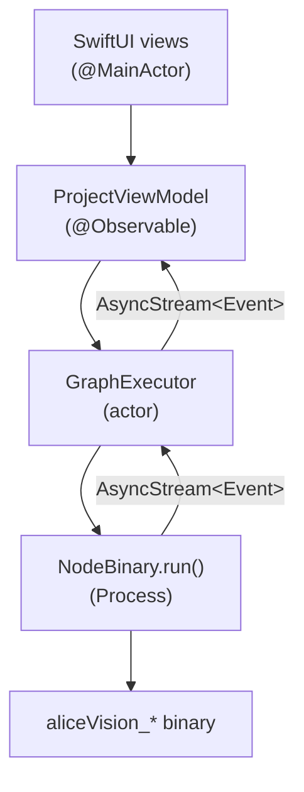

# Native macOS UI

`meshroom-native/` is a **SwiftUI-first replacement** for Meshroom's PyQt5/QML
app. Same `.mg` file format, same 12 `aliceVision_*` binaries, same pipeline
semantics — but a native Foundation/SwiftUI/Process stack instead of Python +
Qt.

Design rationale lives in `memory/native_ui_design.md` (107 node types,
SwiftUI + AppKit hybrid, actor-based orchestrator, `.av` package format).
This page covers what's shipped today.

!!! info "Status — M1 through M6 shipped"
    | Milestone | Deliverable | Status |
    | --- | --- | --- |
    | **M1** | `ProjectModel`: `.mg` round-trip + template ref parser | DONE |
    | **M2** | App scaffold + node list + open `.mg` | DONE |
    | **M3** | Schema-driven parameter forms | DONE |
    | **M4** | Inspector pane + parameter editing | DONE |
    | **M5** | Process orchestrator (`GraphExecutor`) — Run pipeline end-to-end | DONE |
    | **M6** | Graph canvas + drag-to-connect edges | DONE |
    | M7-M9 | Cache UI, 3D viewer, asset library | TODO |

    115 Swift tests pass under `swift test` in `meshroom-native/`.

## Running it

```bash
cd meshroom-native
swift test                          # 115 tests expected
swift run MeshroomNativeApp         # launches the SwiftUI app
```

The app launches into the project view. Open an existing `.mg` with
{++ ++}{{ Cmd + O }}{++ ++} or drop one onto the dock icon.

## Editing a project

### Open / save

| Action | Shortcut | Source |
| --- | --- | --- |
| Open `.mg` | {{ Cmd + O }} | `ContentView.swift:71` |
| Save | {{ Cmd + S }} | `ProjectView.swift:66` |
| Undo / Redo | {{ Cmd + Z }} / {{ Shift + Cmd + Z }} | `@Environment(\.undoManager)` |
| Delete selected node | {{ Delete }} | `NodeGraphCanvas.swift:127` |

Save is wired through a hidden toolbar button so the Cmd-S binding works even
before we wrap the menu via `CommandGroup`. Undo / redo flow through SwiftUI's
`UndoManager` and survive all M4 parameter edits.

### Inspector / parameter editing (M4)

Selecting a node in the canvas reveals the inspector pane on the right. Every
schema-described parameter type is rendered through a matching SwiftUI control:

| `desc.*` type | SwiftUI control |
| --- | --- |
| `IntParam`        | `Stepper` + `TextField` (`Slider` if bounded) |
| `FloatParam`      | `Slider` + `TextField` |
| `BoolParam`       | `Toggle` |
| `ChoiceParam` (exclusive=true) | `Picker(.menu)` |
| `ChoiceParam` (exclusive=false) | multi-select `List` of `Toggle`s |
| `File`            | `TextField` + drop target |
| `StringParam`     | `TextField` |
| `GroupAttribute`  | `DisclosureGroup` (nested) |
| `ListAttribute`   | `List` with add/remove buttons |

Edits are committed through the project view-model so they survive undo.

### Running the pipeline (M5)

Press the **Run** button in the toolbar. The `GraphExecutor` actor topo-sorts
the graph, spawns one `Process` per node, and streams stdout/stderr lines back
to the UI via an `AsyncStream<Event>`. Cancel mid-run via the toolbar
**Stop** button.

The runner respects the same environment variables `scripts/run_meshroom.sh`
sets (`ALICEVISION_ROOT`, `ALICEVISION_BIN_PATH`, `DYLD_FALLBACK_LIBRARY_PATH`)
— see `GraphExecutor.swift:RunConfig`. The Project view's
`makeRunConfig()` helper picks these up from the open project's bin/data
directories.

### Drag-to-connect edges (M6)

In the graph canvas, drag from a node's output socket onto another node's
input socket to create a connection. Edge previews follow the cursor; release
on an incompatible type cancels the operation. Implementation in
`NodeGraphCanvas.swift`; tests in `Tests/AppTests/ConnectionEditingTests.swift`.

## Project file format

```
MyProject.mg                       ← plain JSON
```

The on-disk format is **Meshroom-compatible `.mg`** (see `MGProject` /
`MGGraph` / `MGNode` types in `Sources/ProjectModel/`). The design doc
proposes a richer `.av` package wrapping `.mg` + `ui.json` + cache; that's
M8+ work and not implemented yet.

Round-trip fidelity (load + encode + reload, byte-identical structurally) is
the primary M1 invariant. The custom `MGJSONWriter` emits `45.0` (not `45`)
for original-float values to avoid silent integer collapse on re-decode —
see the rationale in `MGJSONWriter.swift`.

The recursive `MGJSONValue` enum (`null` / `bool` / `int` / `double` /
`string` / `array` / `object`) preserves Meshroom's heterogeneous attribute
schema, including template references like `{CameraInit_1.viewpoints.0.path}`
parsed by `MGTemplateReference`.

## What isn't ported yet

- **6 pure-Python `desc.Node` types** (`ExtractMetadata`, `SfMPoseFlattening`,
  `SfMFilter`, `SfMRigApplying`, `SfMChecking`, `SketchfabUpload`) need either
  a Swift reimplementation or an in-process `pyalicevision` bridge — see
  `memory/native_ui_design.md` §0.
- **3D viewer + asset library + cache UI** (M7-M9). Open in `memory/todo.md`.
- **`.av` package format** (Spotlight-indexed, Quick Look-previewable bundle).
  Design lives in `memory/native_ui_design.md` §1.3; not yet built.

## Architecture



`GraphExecutor` is `final class` (not yet an `actor` — M5 chose serialized
single-node execution; parallel sub-DAGs are a later milestone). It runs at
most one node at a time today. The cache directory layout
(`GraphExecutor.swift` line 19+) follows Meshroom's per-node-UID convention so
existing Meshroom caches can be reused or migrated.
