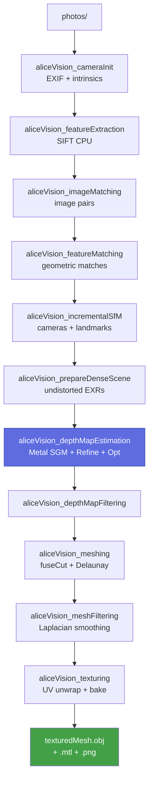

# Running the pipeline

End-to-end: 12 binaries from `cameraInit` to `texturing`. Every binary
preserves the upstream AliceVision CLI surface; no flags were renamed.

## Pipeline stages



## Example: Monstree mini3 (3 JPGs, ~1 min on M4)

The `dataset_monstree/mini3/` directory ships in the repo. It is the canonical
smoke-test scene. Numbers below are from the S41 deliverable (`memory/mental_note.md`
§8i):

| Stage              | Output                                | Stats |
|--------------------|---------------------------------------|-------|
| `cameraInit`         | `cameraInit.sfm`                        | 3 views |
| `featureExtraction`  | `features/`                             | 60K SIFT |
| `imageMatching`      | `imageMatches.txt`                      | 3 pairs |
| `featureMatching`    | `matches/`                              | 11,584 matches |
| `incrementalSfM`     | `sfm.sfm`                               | 7,430 landmarks |
| `prepareDenseScene`  | `dense/`                                | 3 EXRs |
| `depthMapEstimation` | `depthmaps/`                            | 3 depth+sim maps |
| `depthMapFiltering`  | `depthmap_filtered/`                    | 1.05 s |
| `meshing`            | `mesh.obj`                              | 7,807 V / 15,458 F |
| `meshFiltering`      | `mesh_filtered/mesh.obj`                | 7,729 V |
| `texturing`          | `texturedMesh.obj` + `.mtl` + 8192² PNG | 8,431 V / 15,390 F |

Final atlas: 192 MB 8192×8192 RGB PNG sampled from the 3 source images via
multi-band frequency contribution. Total wall-clock for the post-MVS stages
is roughly 9 seconds; the Metal `depthMapEstimation` step dominates at
~12 s / view on a 4032×3024 input.

## Driving the pipeline

The shortest path is the Meshroom wrapper from `scripts/run_meshroom.sh`,
which sets every environment variable the 12 binaries expect:

```bash
./scripts/run_meshroom.sh python meshroom-mac/bin/meshroom_batch \
    -i dataset_monstree/mini3 \
    -o /tmp/monstree-out \
    -p photogrammetryLegacy
```

What the script does (verbatim from the file):

- Activates `meshroom-venv/` (PySide6 + psutil + pyseq).
- Sets `ALICEVISION_ROOT=$ROOT/build/alicevision_root` (the
  `share/aliceVision/{config.ocio,cameraSensors.db,luts/}` runtime data tree).
- Sets `ALICEVISION_BIN_PATH=$ROOT/build` so Meshroom locates the 12 binaries.
- Sets `DYLD_FALLBACK_LIBRARY_PATH=/opt/homebrew/lib` as a safety net for the
  Homebrew dylibs (the binaries are RPATH-resolved by default so this rarely
  fires).
- Points `MESHROOM_NODES_PATH` at `meshroom-mac/nodes` so the macOS-patched
  node descriptors (see [Meshroom integration](meshroom.md)) load instead of
  the unpatched upstream copies.

See [Meshroom integration](meshroom.md) for the patch rationale.

## Driving binaries directly

If you want to skip Meshroom and invoke binaries one at a time, the canonical
sequence on a directory of images is:

```bash
export ALICEVISION_ROOT=$PWD/build/alicevision_root
export PATH=$PWD/build:$PATH

IMAGES=dataset_monstree/mini3
WORK=/tmp/mini3-work
mkdir -p $WORK

aliceVision_cameraInit         -i $IMAGES -o $WORK/cameraInit.sfm
aliceVision_featureExtraction  -i $WORK/cameraInit.sfm -o $WORK/features
aliceVision_imageMatching      -i $WORK/cameraInit.sfm \
                               --featuresFolders $WORK/features \
                               -o $WORK/imageMatches.txt
aliceVision_featureMatching    -i $WORK/cameraInit.sfm \
                               --featuresFolders $WORK/features \
                               --imagePairsList $WORK/imageMatches.txt \
                               -o $WORK/matches
aliceVision_incrementalSfM     -i $WORK/cameraInit.sfm \
                               --featuresFolders $WORK/features \
                               --matchesFolders $WORK/matches \
                               -o $WORK/sfm.sfm
aliceVision_prepareDenseScene  -i $WORK/sfm.sfm -o $WORK/dense
aliceVision_depthMapEstimation -i $WORK/sfm.sfm \
                               --imagesFolder $WORK/dense \
                               -o $WORK/depthmaps
aliceVision_depthMapFiltering  -i $WORK/sfm.sfm \
                               --depthMapsFolder $WORK/depthmaps \
                               -o $WORK/depthmap_filtered
aliceVision_meshing            -i $WORK/sfm.sfm \
                               --depthMapsFolder $WORK/depthmap_filtered \
                               -o $WORK/dense.sfm \
                               --outputMesh $WORK/mesh.obj
aliceVision_meshFiltering      --inputMesh $WORK/mesh.obj \
                               --outputMesh $WORK/mesh_filtered.obj
aliceVision_texturing          -i $WORK/dense.sfm \
                               --inputMesh $WORK/mesh_filtered.obj \
                               --colorMappingFileType png \
                               -o $WORK/textured
```

!!! tip "Two flag gotchas"
    1. `aliceVision_meshing --output foo.abc` errors: *"AliceVision is built
       without Alembic support."* — use `.sfm` (the dense SfMData JSON
       serializer) or `.ply` instead.
    2. `aliceVision_texturing` skips actual texture baking unless you pass
       `--colorMappingFileType png` (or `jpg` / `tif` / `exr`). Default is
       `none` which only writes UV coords.

Both gotchas are documented in `memory/mental_note.md` §8h-i and §8h-ii.

## Sentinel value: `-2` in depth maps

A `depthMap.exr` value of `-2` is the alpha-mask sentinel for image-border
pixels. A view-wide all-`-2` result almost always means alpha-mask config is
wrong — see [Troubleshooting](troubleshooting.md).

## Performance

On M4 (16 GB UMA) the `depthMapEstimation` step takes ~12.2 s / view at
4032×3024 (S43 baseline). After the S44 + S45 optimizations the same step
runs in ~7.8 s / view (-36 % vs baseline). See
[Performance history](../perf-history.md).
